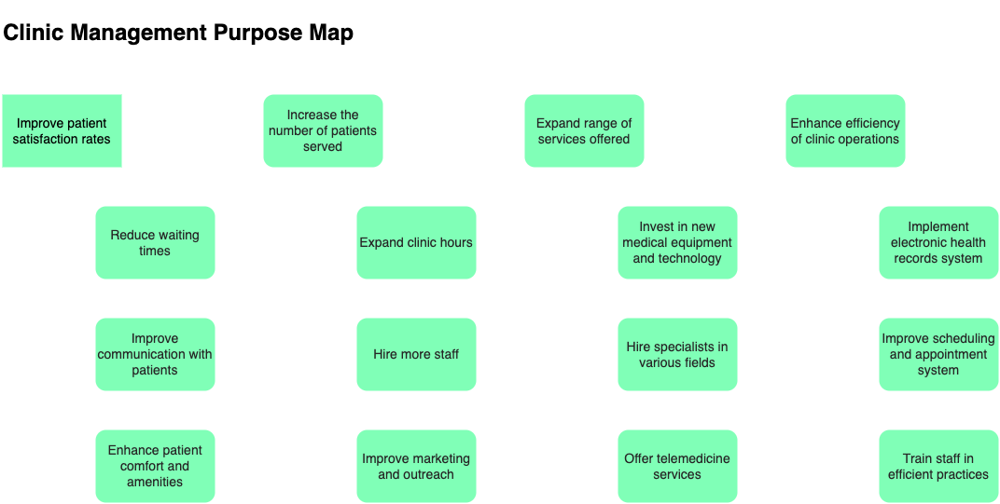
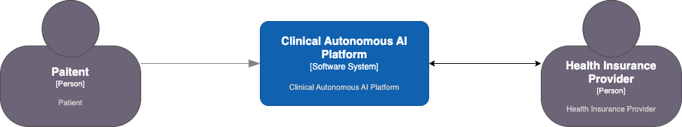
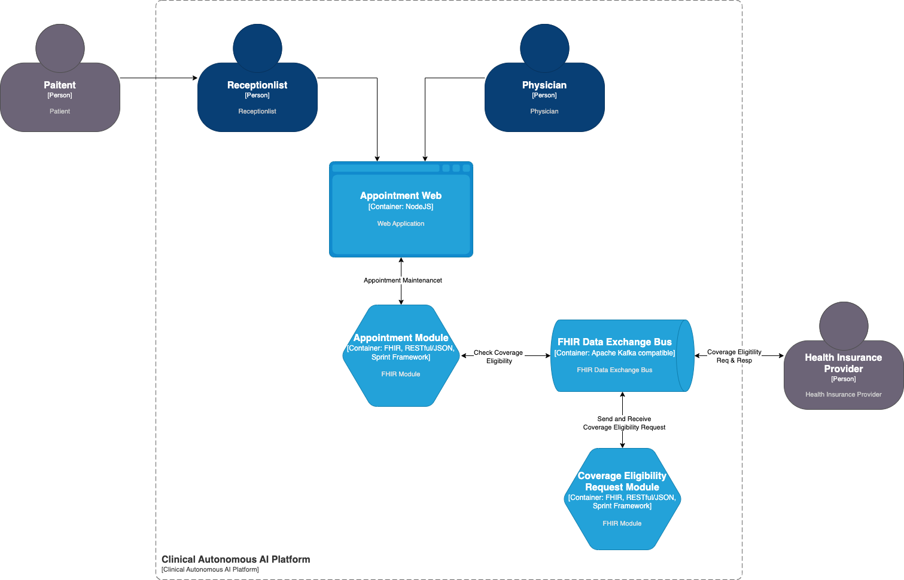

# Project Proposal

# Abstract

Building upon my earlier project proposal "Clinical Autonomous AI Platform" developed during the CP601 course, I aim to extend its foundational concepts into a practical implementation for my CP630 Enterprise Architecture final project (Lai, W.K., 2023). The original proposal envisioned a comprehensive integration hub designed to connect various healthcare agents and streamline clinical management. 

Recognizing the extensive scope of this vision, I have chosen to concentrate on developing a FHIR appointment module. This focus will allow for a manageable yet impactful demonstration of integrating healthcare data using modern technologies.

# Introduction

In the current context in which rapid changes in health technology repairs the application of artificial realization and self-governing systems. This project, which develops the innovative concept, first instituted in the Clinical Autonomous Agent Platform, seeks to realize advanced enterprise computing solutions based on the principles of autonomous agents in the context of clinical practice. I am the perfect co-author of the article who presents an ambitious vision of integrating clinical management SaaS with virtual telemedicine in order to build a highly efficient platform for healthcare improvement in the future (Lai, 2023).

The Clinical Autonomous Agent Platform shall certainly change the game in the healthcare industry in terms of better healthcare delivery and management. By simplifying intricate operations and minimizing the risks of manual mistakes, the platform mitigates the worrying issues that are usually encountered by the service providers thus improving the standard of the service offered and the swiftness of the service as well. The platform is well placed in the expanding GAAIAA market poised for growth no doubt owing to the convergence of clinical management and telemedicine.

To further advance this vision, the introduction of a FHIR (Fast Healthcare Interoperability Resources) on-premise agent is proposed to seamlessly connect with a centralized FHIR data exchange platform (Health Level Seven International, .n.d.).

The addition of a FHIR on-premise agent in the Clinical Autonomous Agent Platform is a deliberate magic key that enables a more coherent, safe, and efficient model of healthcare delivery. It appreciates the fact that although there are healthcare systems that need to talk to each other, there is a need to talk without compromising speed, efficiency, and above all, the quality of patient care and data protection. This novel idea by the platform manifest its innovative potential and its identification towards the advancement of patients’ and caregivers’ experience in healthcare Vorisek et al., 2022).

# Applied Problem

## The Performance Issue of Canada's Healthcare System

This article from the Fraser Institute explains the performance and expenditures of the Canadian health care system and affirms the many shortcomings. Canada is spending the most fraction of its economy on health care (13.3%) and the 8th highest healthcare expenditure on an individual basis, all this has been done in vain. This conclusion comes from a research carried out by Fraser Institute where in 2020 there was a comparison of cost and outcomes of 30 countries providing universal healthcare (Moir & Barua, 2022).

However, the report does convey that the massive expenditure did not result in timely access to specialists and resources. For example, Canada's performance was placed 23rd out of 28 countries that provided somatic care beds per age aggregated population out of 28 countries. Even more, in comparison to most countries, it had fewer physicians per 1000 population, at 28th out of 30, MRI, 26th out of 29 CT Scanners, and 27th out of 30 among other equipment.

It is also due to the shortage of materials that long waits have been imposed on the Canadians. In the year 2020, Canada did not do much better than other countries with a universal healthcare system regarding specialist wait times and elective surgery. Only about a third of Canadians, specifically 38%, indicated that they had to wait less than four weeks to get an appointment to see some specialist. In the Netherlands 69% of patients were able to do this. And 62% of the respondents from the household surveys addressed in this article indicated that they had to wait less than four months to get an elective surgery while only 99% of Germans and 94% of Swiss reported such a waiting time.

The article also notes that Canadian wait times were longer than wait times in other countries prior to Covid covering the wait times measured by Canadian Institute for Health Information in 2018. But at least there is some good news. Canada performed relatively better than the average universal country with respect to heart attack, breast and rectal cancer survival rates. On the other hand, it has also recorded the highest obstetric trauma rate in the 20 countries whose data were available.

## Story of Hamilton Health Sciences (HHS)

The development of Fast Healthcare Interoperability Resources (FHIR) technology in Hamilton Health Sciences has changed the face of lab results in the sense that it became the first hospital to utilize this technology (Hamilton Health Sciences, 2022). HHS'S new Epic Hospital information system has been customized in such a way to allow for FHIR integration with Ontario Laboratories information system (OLIS) to pull up health care related information in real time.  OLIS provides a remote access facility to approved health care providers and it compiles the requests and the results of laboratory investigations from any medical laboratory facilities in the region. FHIR is a state-of-the-art technology developed by Health Level Seven International (n.d.).

It used to be the case that before FHIR, once lab tests results were ready, they would be kept in the lab and a request faxed to the patient’s family doctor and HHS doctor. Not only was this the time where many positives could be addressed but sometimes paperwork could get misfiled and such causes error. Mostly, this would result in doctors and their office assistants begging the laboratories to send again the documents.

After incorporating FHIR into the Epic system, laboratory reports are now available to HHS doctors anywhere in the province and at any time. This implies that if a patient undergoes blood testing anywhere within the province, the results will be uploaded to OLIS and will eventually be accessed by HHS doctors using FHIR.

As a result, less time is spent looking for the requested lab results which enables timely receipt of lab results thus enhancing the quality of patient care. For instance, Mark Berry, a senior consultant with HHS’s health information technology services, told how the commissioning process took much longer before FHIR was put in place. His daughter, a patient with rheumatoid arthritis, would wait for hours during her visits to HHS McMaster Children’s Hospital in order to have her blood results.

## Purpose Map of General Clinic Management

The General Clinic Management Purpose Map is introduced here as a tactical tool to assist with the formulation and implementation of the clinic’s policies and strategies. This map, designed according to the EDGY standard, is a universal plan for the management of the clinic’s objectives and strategies. (EDGY, n.d.).

*Figure 1 - General Clinic Management Purpose Map*

The Purpose Map is oriented on the core goal of improving the productivity of clinics operations. This main objective is further broken down into a number of secondary objectives standing for the areas of activity within the operations of the clinic. These secondary objectives comprise the introduction of an electronic patient’s health records system, the systematization of the scheduling and appointment system, as well as training the personnel in proper, efficient methods of doing their work.

Each of these sub-purposes stands in relation to other specially set goals which can be referred to as the actual sub-purpose sub-structure. These goals establish an operational plan of the clinic management as to what measures have to be put in place for the effective running of the clinic and attainment of strategic goals.

From the above purpose map, it is found that efficient appointment module is pivotal components of the Clinical Autonomous Agent Platform and the first touch point to clinic from paitent’s perspetive. As highlighted in the Clinic Management Purpose Map, improving appointment feature is crucial for enhancing the efficiency of clinic operations. By implementing a streamlined appointment mechanism, the platform aims to significantly reduce patient wait times, a prevalent challenge in healthcare system.

# Applied Solution

This project will focus on building a FHIR-compatible agent for the patient appointment journey as a minimum viable product, enhancing the clinic management experience. The integration of this agent is central to revolutionizing how appointments are scheduled and managed, aligning with the Clinic Management Purpose Map's objectives. By utilizing FHIR standards, the platform ensures seamless data exchange with existing healthcare systems, which is crucial for improving communication with patients and reducing waiting times.

## High Level Conceptual Design

This project is going to use C4 model developed by Brown (2023) to break down the whole idea and visualize overall conceptual design.

### C4 Context Diagram

The C4 context diagram illustrates the interactions between patients, the Clinical Autonomous AI Platform, and health insurance providers. This setup not only facilitates efficient appointment scheduling but also supports expanding clinic hours and increasing the number of patients served. The platform's capabilities allow for better resource management, enabling clinics to optimize staff allocation and improve overall operational efficiency.

*Figure 2 - C4 Context Diagram*

### C4 Container Diagram

The C4 Container Diagram provides an insightful view into the integral components of the Clinical Autonomous AI Platform, focusing on enhancing the patient appointment journey. The platform is designed to streamline interactions between patients, receptionists, and physicians through an Appointment Web Application, which serves as the central interface for scheduling and managing appointments. This system facilitates efficient communication and coordination within the clinic, ensuring that operational workflows are optimized.

Core underlined element of the architecture is the FHIR Appointment Module which makes it possible to manage appointment data in standardized and interoperable way. Through this module, such integration between a clinic and, for example, a health insurer becomes easy making information transfer more accurate. The system includes these components and improves the efficiency of the main clinic management functions, such as shortening the duration of the patient’s waiting time and increasing the overall service delivery.

Moreover, the architecture of the platform is integrated with a messaging system which provides coverage of a highly interactive real-time information exchange which ensures that every party is well-updated. This structural arrangement is commendable especially in the management of resources and decision making timeliness that enhances various levels of patient satisfaction and clinic performance.

*Figure 3 - C4 Component Diagram*

# Proposed Technical Stack

The technology stack we propose for this project comprises several key components, as follows:

- **Web Application Development via the Corteza NoCode Platform** – This part will use Corteza nocode platform to build the preliminary UI platform in record time and without comprises on look or integration to FHIR module through REST api.
- **Implementation of FHIR Modules using Spring Boot** – As an alternative approach Spring Boot, which is developed for building Java applications will be used for Fast Healthcare Interoperability Resources (FHIR) resource, which, as an information standard, is concerned with healthcare application integration in hardwaresoftware systems.
- **Real-time Data Exchange of Information Using Apache Kafka: An Overview of Real-time Data Exchange through External Systems**: This will be achieved with the help of Apache Kafka, a distributed event streaming platform.
- **Deployment via Minikube (Kubernetes Compatible) Container Orchestration Platform**: As application deployment will be done within a single si, Minikube (an application that runs a single node k8s cluster in a VM on your laptop) will be utilized.

# Assumption

Due to time and resource limitation, few assumption is required to document and limit the project scope:

- **Purpose Map Usage -** For this project proposal, we will exclusively utilize the Purpose Map and **EXCLUDE** other EDGY facets. Purpose Map will serve as our primary guide, outlining the objectives of clinic management. No other tools or frameworks will be employed for this purpose in the project proposal.
- Experience Channel - The project will **NOT** include a public-facing API as a user experience channel. This decision is driven by limited time resource.
- **Insurance Provider Integration**: The project will **NOT** integrate with external insurance providers. This assumption is made to limit the project's scope and complexity, acknowledging that it may restrict the range of patient services that can be offered.
- **UI Functionality**: The project will leverage a Nocode UI framework to provide preliminary UI functionality, enabling users to experience FHIR capabilities without too much development effort. This assumption will be validated and managed through user testing and feedback, ensuring that the UI meets user needs and expectations.

# Reference

1. Brown, S. (2023). The C4 Model For Visualising Software Architecture. *Leanpub*. [https://leanpub.com/visualising-software-architecture](https://leanpub.com/visualising-software-architecture)
2. EDGY. (n.d.). Intersection Group. Accessed October 9, 2024. [https://www.enterprise.design](https://www.enterprise.design)
3. Hamilton Health Sciences. (June 29, 2022). HHS is first hospital in Ontario to use cutting-edge FHIR technology for instant lab results. Hamilton Health Science. Accessed October 9, 2024. [https://www.hamiltonhealthsciences.ca/share/faster-lab-results-fhir/#:~:text=FHIR%2C%20which%20stands%20for,access%20OLIS%E2%80%99%20health%2Dcare%20information](https://www.hamiltonhealthsciences.ca/share/faster-lab-results-fhir/#:~:text=FHIR%2C%20which%20stands%20for,access%20OLIS%E2%80%99%20health%2Dcare%20information)
4. Health Level Seven International. (n.d.). *FHIR appointment resource (version 5.0.0)*. [https://www.hl7.org/fhir/appointment.html](https://www.hl7.org/fhir/appointment.html)
5. Lai, W. K. (2023). Clinical Autonomous Agent Platform. *GitHub*. Accessed October 5, 2024. [https://github.com/reidlai/ClinicalAutonomousAgentPlatform](https://github.com/reidlai/ClinicalAutonomousAgentPlatform)
6. Moir, M. & Barua, B. (November 23, 2022). Despite high spending, Canada’s health-care system is failing badly. Fraser Institute. Accessed October 5, 2024. [https://www.fraserinstitute.org/article/despite-high-spending-canadas-health-care-system-is-failing-badly](https://www.fraserinstitute.org/article/despite-high-spending-canadas-health-care-system-is-failing-badly)
7. Vorisek, C. N et al. (2022). Fast Healthcare Interoperability Resources (FHIR) for interoperability in health research: Systematic review. JMIR Medical Informatics, Vol. 10 (2022), No. 7. [https://doi.org/10.2196/35724](https://doi.org/10.2196/35724)

[Draft Work](https://www.notion.so/Draft-Work-116a365ace5e8056ab78d654c1e9a593?pvs=21)