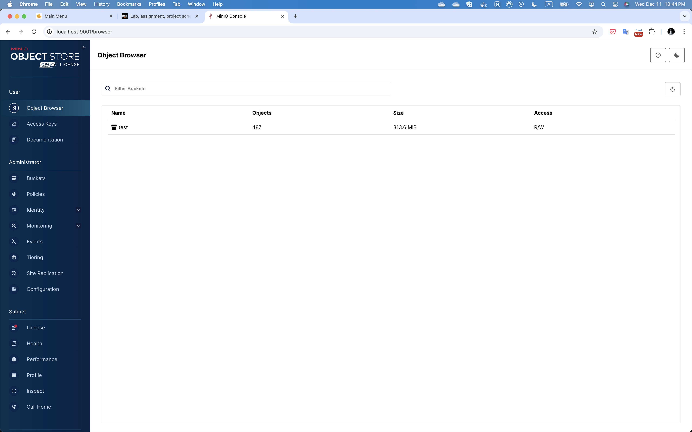

# PROJECT Report

Author: Wai Kei LAI

Date: 2024-10-10 

Check [readme.txt](readme.txt) for course work statement and self-evaluation. 
  

## R1 Requirements (project)

### R1 Write a project proposal (2-3 pages).

Complete? (Yes/No) Yes

If Yes, briefly describe: 

1. what you have done, 
2. what are the new features. 
3. Take some screen to demonstrate the features if applicable. 

#### Introduction

In the period of advancement of technology and financial development, there has been a drastic increase in such activities as credit card payments, banking, online fund transactions and others as a result of the expansion of information technology. While this increase in financial activities has made capital and resource deployment to be more effective, it has also exactly led to the increase of fraudulent activities. Because of the arising complexity of the fraudulent transaction, its defenders fall behind the old solutions and seek for advanced means for counterfeiting and fraud deterrence.

Option Consommateurs (2024) published a report which showed that around 30% of the Canadians remember themselves being a victim of the bank fraud. In fact, among those who felt the effects of bank fraud, almost 25% have taken some measure to defend themselves after the incident. This indicates that the aftermath of such kinds of fraud is not only loss of money but also loss of peace of mind, and victims become more vigilant on the security of their assets.

Fraud is a common phenomenon in the financial arena. Credit card fraud, banker cheque fraud, and EFT fraud and all of them pose great risk to the financial institution and its clients. This misuse of information or financial assets is caused by scam or dishonest persons with serious consequences to economies and the security of consumers. As a result, the issue of fraud transactions which has become common in financial transactions needs to be cured fairly very quickly by all concerned parties in this case the financial institutions.

The classical approaches which have been adopted by many of the companies whereby the review of transactions are being done on manual basis and most times more rules limits systems, is becoming more obsolete not because such systems are not in existence but because the fraud depots have become more advanced in their tactics. The procedures are very time consuming and require a lot of manpower and barely keeps pace with the development of the changes of the type of fraud. Therefore, new technologies for detection and measures to prevent fraud are needed which will be able to provide performance and flexibility in the timely and seamless detection of unauthorized activities.


#### Problem Solving and Algorithms

Over the past few years, ‘machine learning’ techniques have developed as one of the recent technologies for solving problems related to fraud detection in financial transactions. Before applying any model, it is understood that using machine learning requires a large volume of data which comprises past activities connected with fraud and instigates models to recognize them efficiently. Such models can also be designed using historical data on transactions and will keep getting better as additional data will continue becoming available.

In response to this pressing issue, various machine learning techniques have been proposed for fraud detection. One such technique involves the use of LightGBM for Credit Card Fraud Detection (Huang, 2020). This innovative approach to fraud detection could potentially be applied to our project, offering a promising solution to this pervasive problem with supporting  research by Du et al. (2023).

The primary objective of this project lies in identifying the suitable Proof of Concept within the appropriate context and testing the model based approach in the financial market using machine learning methods. The solution will include the use of the Kaggle Dataset ealtman2019/credit-card-transactions as it is based on the publication of Altman, E (2019). A number of elements may be identified as being part of this issue and the answer.

1. **Dataset Acquisition**: For the purpose of obtaining the dataset from Kaggle It is necessary to have a web UI as the AI Engineers will find it more convenient to fetch the required dataset from the UI. 
2. **Data Review and Mapping**: Up to this point, the dataset is in the AI Engineer’s hands, so the schema of the dataset will be examined by the AI Engineer. An editor will be required in order to ease this occasion. Such tool will also allow artificial intelligence engineers’ simple data mapping on different dataset file format that are part of the dataset. They can also find pertinent attributes in the data and map them to their functions as well. Eventually, such mapping will support data understanding and also form part of the data to be fed into the machine learning training and development. This visual tool will improve the process of reviewing data and also ensure that the AI model uses the important components.
3. **AI Model Development**: The final step is the deployment of the ONNX model derived from the well trained AI model developed at the final stages of the training and testing processes.
4. **Transaction Validation**: To trigger the validation step, a payment gateway facing Payment Order API is being developed which will integrate with Payment Processing backend service. This particular service will leverage another machine learning inference background service which loads the AI model for fraud detection. If a transaction is suspected to be fraudulent then the transaction will be put on pending and security officer needs a UI which can review the pending transaction when receiving customer’s enquiry.
5. **Notification of Customer**: Also if the transaction is recognized as a potentially fraudulent one, the customer will be sent an email about the potential fraud and further security check process.

##### Conceptual Design

###### Context Diagram

This project is going to use C4 model developed by Brown (2023) to break down the whole idea and visualize overall conceptual design.

<figure>
    
    <figcaption>Figure 1 - C4 Context Diagram</figcaption>
</figure>

Figure 1 illustrates the interactions between customer and the Payment Solution with Fraud Detection using AI. This setup not only facilitates efficient fraud detection automation but also supports to customer about their credit card payment. The platform's capabilities allow for better resource management, enabling financial institution to optimize internal resource efficiency and improve overall customer satisfaction from security perspective.

###### Container Diagram

<figure>
    
    <figcaption>Figure 2 - C4 Container Diagram</figcaption>
</figure>

In Figure 2, the system is subdivided into several vital containers as follows:

1. **Data Processing**: AI Engineer needs to prepare datasets for ML model training and testing and extracted data will be upload to database serving payment request feature mapping when receiving fraud detection request service.
2. **Payment Request Store**:  This relational database store gets to store payment requests and payment request status.
3. **MLOps Pipeline**: This is a very important container whereby information mapping from dataset to database table, data clean-up, feature engineering, model training and testing take place.
4. **Machine Learning Model**: This is LightGBM model mentioned by Huang (2020).
5. **Payment Processing Service**: This is public facing service that expose to payment gateway and response for the processing of payments from merchants who made the Payment request.
6. **Machine Learning Inference Service**: This services mainly serve all fraud detection request against incoming payment request. It will get and use machine learning model to identify any possible frauds.
7. **Payment Notification Service**: This service sends email alerts to customers if the transaction is successful or on hold if potential fraud detected.
8. **Payment Request Portal (Fraud Detection Portal):** This UI targets to serve security office to manage payment request, especially those with fraud detected by Machine Learning Inference Service.

###### Business Events and Workflow

<figure>
    
    <figcaption>Figure 3 - BPMN Model</figcaption>
</figure>

In this session, BPMN (n.d.) is used to illustrate how alll business process orchestrates together to deliver fraud detection solution. BPMN standardizes the way in which the business processes are represented in a diagrammatic way, thereby making the description of the workflow system less cumbersome. It allows the readers to depict accurately the position of tasks, deadlines, events, decision points, and the interactions among people and parts of the system. This means that it can improve partnership and coordination among business analysts, developers as well as system end users.

<table>
  <tr>
    <th>BPMN Lane</th>
    <th>Business Event</th>
    <th>Description</th>
  </tr>
  <tr>
    <td>Fraud Detection Portal</td>
    <td>Customer callback to query about on-hold transaction</td>
    <td>Security Officer will use this UI to query on-hold transaction and change the status from “on-hold” to “proceed” after review.</td>
  </tr>
  <tr>
    <td>Payment Processing Service</td>
    <td>Make payment request</td>
    <td>Payment processing is initiated by external payment gateway when merchant submit payment request to financial insituition.</td>
  </tr>
  <tr>
    <td>Machine Learning Inference Service</td>
    <td>Request fraud detection service</td>
    <td>The Payment Processing Service uses the Model Inference Service to identify the chances of Fraud in the Payment Request using a ML Model deployed by the system.</td>
  </tr>
  <tr>
    <td>Payment Notification Service</td>
    <td>Update payment transaction status</td>
    <td>When receiving notification request from Payment Processing Service, this service will retrieve customer name and email address, render the final email using email template, and send to SMTP server using SMTP Relay Service.</td>
  </tr>
  <caption style="caption-side:bottom">Table 1 - Business Process Lanes</caption>
</table>

<h7>Payment Processing Service</h7>

<figure>
  
  <figcaption>Figure 4 - Payment Processing Service Component Diagram</figcaption>
</figure>

As it can be seen in Figure 4, the Payment Processing Service, as part of the transversal functions within the Credit Card Fraud Detection Solution, allows receiving payment requests while avoiding the risks . Figure 4 shows how it contains several components that ensure that payments are made seamlessly.

Payment Gateway sends Payment Request and a REST Controller initiates a service that is the first in the payment request chain. This controller’s responsibility is to implement the workflow which consists of initiating the fraudulent detection of the payment and payment data management. In order to check if there is possible fraudulent abuse, the Payment Request Controller sends the request, which contains data, to the Model Inference service. Data comes back to this service which in turn has some actionable data which the controller considers some its relevant data and asleep out. When all operations have been performed to check the fraudulent abuse then Model Inference Service makes any necessary modification updates for the fraud detection.

The Payment Request REST Controller certainly does an extra job, it validates that there exists a payment request concerning the payment which is somewhere in the system. It connects with the database client and ensures that the request on payment is recorded in the Payment Request Store, which is a live payment application service. This ensures therefore that all the information regarding the payment is captured and can be retrieved for use or for record purposes.

Once generally evaluated and the payment request status is updated, it is efficiently transmitted the statsus back to external payment gateway. This client calls the payment gateway callback interface.

<h7>Machine Learning Inference Service</h7>

<figure>
  
  <figcaption>Figure 4 - Model Inference Service Component Diagram</figcaption>
</figure>

The Model Inference Service is an important part of the Credit Card Fraud Detection Service and is aimed at preventing fraud attempts in a payment order. It serves as the link between the Payment Processing Service and the fraud detection machine learning model. This service makes sure that every payment order has passed through the fraud assessment, and the outcome has been returned to the concerned stakeholders.

The service initiates its workflow through the Service Request Handler, which deals with incoming requests from the Payment Processing Service. In case a service request is raised for the purpose of fraud detection, the Service Request Handler takes the charge and sends the request to the Model Inference Engine. The Model Inference Engine is the single engine of the service, which runs the machine learning model using payment data as the input. It engages in a working relationship with the Machine Learning Model that has been uploaded with algorithms and the relevant data to display trends of suspiciousness in the payment requests.

When the fraud detection i.e. review procedure ends, it generates a result indicating whether there exists a chance of the current transaction being fraudulent rather than normal. This result is then routed back to the Payment Processing Service in order to bring level of fraud detection of the corresponding payment request to the appropriate level. Furthermore, the request handler also performs the function of informing interested parties in the state of the payment through the payment notification service in order to ensure that the result of the fraud detection process is indeed notified.

<h7>Payment Notification Backend Service</h7>

<figure>
  
  <figcaption>Figure 4 - Payment Notification Service Compoent Diagram</figcaption>
</figure>

The Payment Notification Service acts as a communicating channel for reliable and secure intercourse of information between the system, and the customers. The main objective of this service is to provide information to clients about incoming payment requests especially those assessed to be suspicious.

This service in its implementation is quite professional and is designed to be secure against tampering. The request handler only considers the customer ID as the needed parameter. After that the handler fetches the customer’s name and email address which does not compromise personal information and minimizes data breaches.

In addition the service uses the official company email or its variations that were previously constructed for all the purposes of correspondence. Such an approach guarantees orthodoxy and uniformity of the messages as well as the self-defense of the corporation from delictous phrases. Thus, the Payment Notification Service assists to secure the system and at the same time enables great communication with the clients.

If customers concern their on-hold payment if potential fraud detected, they need to approach security officer for further verificaition and special handling.

##### Proposed Technical Stack

The given technical stack utilizes commonly used or well known technologies and frameworks thus making it secure and easily adaptable to changes. The payment solution with fraud detection based on machine learning relies on the combination of Spring Boot as backend, Svelte as frontend, Mage.AI for MLOps, PostgreSQL for data storage, Minio for object storage, Docker for virtual technology and LightGBM as algorithm for dynamic fraud detection in payments.

Due to limited project timeline and PoC purpose, the following technical components ddi not include in this phase:

 - API Gateway (proposed: Kong API Gateway or Hashicorp Consul Connect)
 - Authentication and Authorization (proposed: Casdoor and Casbin)
 - HTTP Proxy (proposed: Caddy reverse proxy with Casdoor and Casbin integration)
 - Message Bus (proposed: Kafka compatible project or NATS messaging)


### R2 Design data format, collect data, create dataset for the application.

Complete? (Yes/No) Yes

If Yes, briefly describe: 

1. what you have done, 
2. what are the new features. 
3. Take some screen to demonstrate the features if applicable. 

#### **Dataset Acquisition**

The real-world application problem is reinforced with great emphasis to the web UI component of the AI business model as it enables the engineers to satisfactorily cope with the data acquisition element within the strict time boundaries of the project. In the fast pacing technology space today, [Mage.ai](http://mage.ai/) happens to be one of the best codeless MLOps tools. It has a clear competitive advantage due to its architecture allowing the incorporation of Singer specification datasources connectors. This incorporation enables the performance of routine ETL activities and operation time tabling, which in turn improves the workflow performance.

<figure>
  
  <figcaption>Figure 5 - Mage.ai Dashboard</figcaption>
</figure>

<figure>
  
  <figcaption>Figure 6 - Data Processing Pipeline</figcaption>
</figure>

<figure>
  
  <figcaption>Figure 7 - Data Processing Pipeline Trigger</figcaption>
</figure>

<figure>
  
  <figcaption>Figure 8 - Data Processing Pipeline Editor</figcaption>
</figure>

As for Figures 5 to 8, these Figures demonstrated how the entire pipeline (which is batched ETL) functioning was performed to migrate Altman’s data set (2019) into PostgresSQL 16 and Apache Parquet File in MinIO object storage. The full source code of Mage.ai is available in project/data-processing.

##### **Huge Data Volume**

The descriptive analysis of Altman’s data set (2019) notes inferring transactional dataset, which is noted to be a vast dataset that comprises approximately 2.5 million transaction records. It resulted in serious performance degradation when employing standard pandas's dataframe which is the building core of context data framework used by Mage.ai. Though, this problem was ultimately fixed by the usage of rust-based Polars dataframe library including its astonishing copying technology and csv batch reader’s specialized ability.

##### Minio as archive storage

Minio plays a crucial role in the acquisition of Kaggle dataset. As an open-source, high-performance, Amazon S3 compatible object storage system, Minio provides us with a simple and cost-effective way to store and serve the massive amounts of data required for our project. Its compatibility with Amazon S3 allows us to leverage the robustness and reliability of Amazon's storage infrastructure, while its open-source nature gives us the flexibility to customize and optimize it to suit our specific needs.

In the MLOps pipeline, Minio serves as archive storage at this current stage.  But I believe Minio can be used as the primary object storage system to feed in model training and testing process with integration with Polars in the next release. It efficiently stores and retrieves large volumes of data with multiple batches or data chunk, which is essential for large data volume loading. The scalability and security of Minio also ensure that our data is safe and accessible, even as the volume of data grows.

<figure>
  
  <figcaption>Figure 9 - MinIO Login</figcaption>
</figure>


<figure>
  
  <figcaption>Figure 10 - MinIO Bucket</figcaption>
</figure>

<figure>
  
  <figcaption>Figure 11 - MinIO Bucket Object List</figcaption>
</figure>

##### Polars

The reason I prefer Polars instead of Pandas is mainly due to its batch reading functionalities. This feature enables us to read in large quantities of data quickly, which is what we need for this project since we are working with a big dataset from Kaggle that contains past activity data connected with fraud. Besides, if we would use Pandas, dealing with those enormous datasets is not likely to be quite as simple since it appears that this library has limitations with respect to memory management for huge datasets.

Polars has another interesting aspect its support for lazy execution. This means that computations are only done if necessary, resulting in much better performance especially for large datasets. On the other hand, with Pandas, all the computations are done at once, May be at the expense of slower processing time and increased memory usage.

Polars also allows for data manipulation operations such as filtering, aggregation or sorting, and supports multiple data types including integer, float and boolean, date, time and string. All of these make it a multifunctional instrument for working with and analyzing data essential in us for the data processing pipeline.

```
# Python file txn_data_csv.py
...
# Create batch reader and batches from Kaggle dataset
reader = pl.read_csv_batched(file_path + "/" + file_name)
batches = reader.next_batches(10000)

# Create mion client
client = Minio(
    endpoint=minio_endpoint,
    access_key=minio_access_key,
    secret_key=minio_secret_key,
    secure=False
)

# Loop batches
for df in batches:
    # Remaining code
...
```

### R3 Develop and implement data application algorithms for the proposed application problem.

Complete? (Yes/No) Yes

If Yes, briefly describe: 

1. what you have done, 
2. what are the new features. 
3. Take some screen to demonstrate the features if applicable. 

#### MLOps Pipeline

[Mage.ai](http://mage.ai/) in its full extent is an important utility in the data science armamentarium especially for data cleaning and feature engineering. [Mage.ai](http://mage.ai/)’s clean user interface and rich set of features make waves in what is usually recurrently the most boring and tedious work that is data preparation and data transformation. Still, as far as this project is concerned, which was limited to a quarter’s period, the use of Jupyter Notebooks turned out to be a more appropriate option. Interactively, Jupyter notebooks provide a comprehensive platform by allowing code, visualizations and written text to be presented and run in the afterthought. As a result of this, the team was able to iterate faster, collaborate more effectively, and deliver the project in the specified time.

##### Run Data Pipeline in Jupyter

The data pipeline consists of four distinct stages - Data Processing, Data Profiling, Data
Cleansing and Feature Engineering.

<figure>
  
  <figcaption>Figure 12 - Data Pipeline Concept</figcaption>
</figure>

The first stage is the raw data acquisition or data processing and formats the data into a form that can be used for subsequent analysis. The second stage is data profiling which involves examining the structure of the data set for possible errors and exploration of patterns within the values of the data. After profiling data comes the third step that involves imputation or the removal of outliers also known as data cleansing which is done to improve the quality of results that will be obtained from the latter analyses. The conclusion of this step is the creation of combined variables by engineering which improves the representation of the data for the learning algorithm.

##### Data Processing

The dataset has been brought to PosgresSQL database and MinIO object storage, this section shall pass on data processing implementation details. Please find all details in the above section “Dataset Acquisition”. Alliances views the data volume perspective of her file, credit_card_transactions-ibm_v2.csv as report with a size of 2.35GB. This figure is too huge for machine learning.

###### Database

We sought to execute a query on the data for the database table transactions so as to comprehend the distribution pattern of the data. A total of 3281 fraud transactions were discovered in the year 2015 and 3579 records in the year 2016. The total number of records in both years is 3410295. This volume appears satisfactory to create the data model.

```sql
SELECT
  EXTRACT(YEAR FROM transaction_datetime) AS transaction_year,
  fraud_detected,
  COUNT(*)
FROM
  transactions
GROUP BY 
  transaction_year, fraud_detected
ORDER BY 
  transaction_year, fraud_detected;
  
Output 
======
"transaction_year","fraud_detected","count"
"1991",False,"1585"
"1992",False,"5134"
"1993",False,"8378"
"1994",False,"14316"
"1995",False,"20928"
"1996",False,"29935"
"1996",True,"10"
"1997",False,"49721"
"1997",True,"32"
"1998",False,"78313"
"1998",True,"32"
"1999",False,"118226"
"1999",True,"24"
"2000",False,"177558"
"2000",True,"171"
"2001",False,"257644"
"2001",True,"354"
"2002",False,"350593"
"2002",True,"139"
"2003",False,"466097"
"2003",True,"311"
"2004",False,"596383"
"2004",True,"620"
"2005",False,"746424"
"2005",True,"229"
"2006",False,"907675"
"2006",True,"1118"
"2007",False,"1062602"
"2007",True,"1881"
"2008",False,"1219750"
"2008",True,"3710"
"2009",False,"1354294"
"2009",True,"1140"
"2010",False,"1487390"
"2010",True,"3835"
"2011",False,"1570496"
"2011",True,"55"
"2012",False,"1609496"
"2012",True,"1333"
"2013",False,"1648899"
"2013",True,"2018"
"2014",False,"1671291"
"2014",True,"1052"
"2015",False,"1698090"
"2015",True,"3281"
"2016",False,"1705345"
"2016",True,"3579"
"2017",False,"1723105"
"2017",True,"255"
"2018",False,"1719124"
"2018",True,"2491"
"2019",False,"1721851"
"2019",True,"2087"
"2020",False,"336500"
```

In the jupyter notebook **<project_root>/project/mlops_pipeline/mlops_pipeline.ipynb**, query joining customers, cards, transacations load data set between January 2015 and Dec 2016.  In order to reduce newtork traffic and rerun data pipeline from step if crash happened. Parquet file format was used to keep dataframe in disk persistence for checkpoint puprose.

##### **Data Profiling**

Data profiling is a technique used to observe the data distribution of each feature. It provides an overview of the data by providing information about min/max values, mean, null or infinite values, and count. This helps us to identify any outliers in our dataset which can then be removed through data cleansing techniques. Data profiling serves as an important starting point for further analysis and understanding what type of cleaning might be required for our dataset before we move on with other tasks like machine learning models building.

Exploratory Data Analysis (EDA) is a ground-breaking book in the field of data analysis. It introduces and explains the principles of exploratory data analysis, which involves analyzing datasets to summarize their main characteristics using statistical graphics and other visualization methods (Turkey, 1997).

EDA framework helps describe a set of data features, expose its inner structure, get out important variables, identify any anomalies and outliers and test for the underlying assumptions. Here are some problems that may be discovered in an EDA report:

- **Missing Values** - By using EDA it is possible to find columns with missing values. In this regard, you will probably replace or rather remove them depending on what proportion of values were not found.
- **Outliers** - In case there are outliers in your data, performing EDA can help you to detec them. Such cases differ greatly from other observations. These strange values might be true or erroneous.
- **Distribution of Data** - When one does exploratory analysis of data, he/she can understand its distribution too well. If it’s skewed, then it might not work as expected by some machine learning algorithms.
- **Correlation** - Furthermore, through conducting EDA on your dataset you can also determine if there are any correlated features among them which will lead multicollinearity among linear regression models if they have highly correlated features.
- **Constant Features** - Moreover, one may equally use this step to determine if there are any constant features in dataset that lacks useful information hence, they need to be deleted as well.
- **Categorical Variables** - Additionally, when engaged in exploratory analysis of data one may also find out how many categorical variables exist and their distinct categories too since a few categories might have minimal counts thus requiring special treatment separately.
- **Feature Magnitude** - Furthermore another thing that comes into the picture during EDA is whether the different measures are being used for scaling features for such algorithms like learning machines where scale needs to be uniform across all these arrays.

YData Proflding API was adopted to provide quick EDA Analysis into preliminary features and labels within a dataset before any further ML tasks are undertaken. Detail EDA report can be found at **<project_root>/project/mlops_pipeline/data/ydata_reports/initial_eda_report.html**.

<figure>
  
  <figcaption>Figure 13 - Initial EDA Analysis</figcaption>
</figure>

##### Data Cleansing

Data Cleansing stage handles missing values, outliers, feature engineering, etc. This could involve techniques such as imputation or removal of instances with missing values, depending on the proportion of missing data and the specific requirements of your analysis or model.

A strategic change is being introduced in our data processing pipeline to ensure efficiency and coherence. We will merge Exploratory Data Analysis (EDA) with the data cleaning step. As a result, we can now spot missing values, outliers or other red flags easily during clean-up. This way, EDA helps us to ensure that our data is not only clean but also understood as well leading to more precise and dependable subsequent analysis and models. In this way, one can be sure that all the relevant information regarding the used dataset has been found before any decision on further steps for pre-processing is made.

<aside>
***Remarks**: The original design was planned to upload ONNX model to Minio and allows SpringBoot application load it dynamically. Because of rushing out project time resource, this implementation changed directly to bundle ONNX model into SpringBoot docker image together with other parameter files with .json extension.*
</aside>

###### Constant Features

In the context of EDA, the first step and effort can be to interface with constant features so as to remove them because they do not convey any relevancy and cannot be utilized in predictive modeling. The term “constant feature” refers to any feature where the value is the same across all records in the dataset.

The following columns were identified as belonging to constant features

 - card_on_dark_web - has False value only

###### Missing Values

Columns having missing values can be spotted during EDA. With regard to this, it is umost likely you delete them or let’s say fill them in, on what the percentage of values were missing so long it was not too great a number. The available dataset has 428339 missing values under \merchant_state attribute with 12.6%, merchant_zip has 449930 missing values with 13.2%, and transaction_error has 3355771 missing values which is 98.4% of the total rows. First let’s take a look at “transaction_error”. In this case, we should mention that the derived value comes from ‘No Error’ so the stating error ‘No Error’ is considered quite enough for solving problems. For the "merchant_state" and "merchant_zip" attributes, in respect of the timeline to complete the project, these types of transactions will be bypassed at this phase.

###### Unique Values

They rightfully advise that such unique values are also indicative of possible outliers, which are values that fall well outside the expected range and can impact the performance of the model adversely. The EDA report signaled unique value found in feature “transaction_id”. In fact this feature is system generated and does not have any significance for target prediction.

###### Zero Values

EDA reported that feature "total_debt" and "card_index" have zero values.  These alerts will be ignored. Debt of zero dollar makes sense for those card holder holdig healthy record while card_index is a meaningless identifier for target.  Handling for "card_index" will be discussed later.

###### PII Data

To respect data privacy, all PII data will be removed from data set including “first_name”, “last_name”, “address”, “email”, and “birth_month”.

###### High Correlation

High Correlation Removal reported in EDA report is necessary for variable duplication to reduce dataset side and outliers. After reviewing the high correlation alerts, the following attributes will be removed.

As for the columns generated by the system but which do not have any relevance to the prediction made are:

- account_open_date
- card_id
- card_index
- card_number
- credit_limit
- customer_id
- current_age
- cvv_code
- has_chip
- merchant_id
- merchant_state
- merchant_zip
- per_capita_income
- yearly_income

###### DateTime Features

Chronicling time is a crucial aspect in identifying fraud, as it delineates the trends and sequence of fraudulent activities that take place, allows risk evaluation on an instant basis, and enables the model to be more efficient. Criminals are said to operate on time schedules, thus, time framed transactions or a series of transactions in a short time could be suspicious. Time helps understand the normal behaviour of a client and its deviation as well as aids in fraud detection while cutting down unnecessary detections. Also, temporal context is important in systems that are aimed at preventing fraud in real-time because such systems must take into account the time of the day, regions and times of the year that affect genuine transaction. Correctly measured time variables improve the overall performance of models aimed at detecting fraud in all its forms.

###### Categorical Variables

It is important to identify and analyze categorical variables as they can greatly impact one’s analysis and predictive models. Some categorical variables may need special treatment like encoding, grouping or even excluding them altogether from the analysis if they contain too many categories (high cardinality) or very few observations (low frequency).

Weighted Target Encoding is a novel encoding scheme that applies both global and local statistics to improve the encoding of categorical features. The overall mean (for instance, the overall fraud rate) and the segmented means are blended together using a category frequency driven smoothing constant. The general formula of applied values is computed as follows: 

$$
(weight * category_mean) + ((1 - weight) * global_mean), where weight = n / (n + min_samples).
$$

Particularly, this approach is relevant for finding frauds owing to:

- mitigate data sparsity by taking into account both infrequent and frequent patterns of frauds
- increase the robustness of the encodings by incorporating both global and local metrics
- work well with non homogeneous category distributions in the transactional data
- help in improving the signal to noise ratio
- not compromise on the importance of the encoded feature

Moreover, the ability of the method to adaptively smooth in rare categories is its main benefit over basic target encoding, which makes it appropriate for fraud detection which has rare patterns that abuse the norm. The smoothing parameter can be altered during the process to account for global trends or bias towards specific category fraud rates.

It is crucial to ensure that all categorical variables take a numerical value which is crucial for the subsequent steps of MLOps pipeline namely:

- gender
- card_brand
- card_type
- merchant_city
- merchant_mcc_code
- transaction_error
- transaction_type

###### Feature Magnitude

Feature magnitude issues can happen when some features in a dataset have different scales. This may impact the efficiency of data analysis algorithms that are scale sensitive.

To begin with, one can define a boxplot as a graphical representation of statistical data used to detect outliers. Outliers are usually values that fall below Q1 - 1.5IQR or above Q3 + 1.5IQR where the first and third quartiles are Q1 and Q3 respectively, and IQR is the Interquartile Range (Q3 - Q1).

A box plot is made up of a box (that’s why it’s called a box plot) which represents the IQR, a line that shows the median value within the box, and two whiskers extending from the box to represent the range of values covered by 1.5*IQR for data. Those lying beyond the whiskers are outliers.

###### Target Encoding

Finally encoded_df need to map fraud_detected to 0 and 1 to numericalize target column

###### Duplicate Rows

Dropping duplicate rows does not have big impact against final prediction.

###### Feature Magnitude

Feature magnitude issues can happen when some features in a dataset have different scales. This may impact the efficiency of data analysis algorithms that are scale sensitive. Standardization scaling techniques was applied to handle such cases before using the data for further analysis or model training.

The following boxplot shows that encoded data has serious feature magnitude issue.  Most of features scaled down to zero while the scale of total debts ranging from 0 up to over 450,000.  This situation may impact the upcoming deep learning input.

<figure>
  
  <figcaption>Figure 14 - Feature Magnitude Boxplot before scaling</figcaption>
</figure>

To solve magnitude issue, Standard Scaler was used to balance all numerical features.  Figure 15 shows the improvement after applying scaling method.

<figure>
  
  <figcaption>Figure 15 - Feature Magnitude Boxplot after scaling</figcaption>
</figure>

###### Outliers

Outliers are observations that deviate significantly from other data points. They can be detected in several ways during Exploratory Data Analysis (EDA). Based on the previous boxplot, it uses 5th and 95th percentile to visualize those outliers.

A study carried out in 2021 compared different outlier detection techniques to help data scientists select an algorithm for building a better model (Agarwal & Gupta, 2021). The researchers concluded that Angel-based Outlier Detection (ABOD) and One-class SVM (OCSVM) techniques improved data analysis and machine learning model performance most across classifiers. In addition, each classifier had specific outlier detection techniques performing best.

###### Data Distribution

The deviation of data can have an effect on how statistical analysis and machine learning models perform. To address this, the data should be transformed to center at zero and have a standard deviation of unity. This paper will discuss different approaches to dealing with skewed data using Python.

```plaintext
Skewness DataFrame:
shape: (23, 3)
┌───────────────────────────┬───────────┬─────────────────────────┐
│ Column                    ┆ Skewness  ┆ Interpretation          │
│ ---                       ┆ ---       ┆ ---                     │
│ str                       ┆ f64       ┆ str                     │
╞═══════════════════════════╪═══════════╪═════════════════════════╡
│ merchant_city_encoded     ┆ 2.193569  ┆ Highly skewed           │
│ merchant_mcc_code_encoded ┆ 1.845289  ┆ Highly skewed           │
│ card_type_encoded         ┆ 1.785501  ┆ Highly skewed           │
│ transaction_type_encoded  ┆ 1.530993  ┆ Highly skewed           │
│ transaction_error_encoded ┆ 1.0       ┆ Highly skewed           │
│ longitude                 ┆ -0.820656 ┆ Moderately skewed       │
│ total_debt                ┆ 0.524274  ┆ Moderately skewed       │
│ transaction_amount        ┆ 0.471247  ┆ Approximately symmetric │
│ birth_year                ┆ -0.454947 ┆ Approximately symmetric │
│ card_brand_encoded        ┆ -0.407727 ┆ Approximately symmetric │
│ latitude                  ┆ -0.352895 ┆ Approximately symmetric │
│ card_expiration_year      ┆ -0.326644 ┆ Approximately symmetric │
│ credit_score              ┆ -0.272157 ┆ Approximately symmetric │
│ transaction_hour          ┆ 0.239463  ┆ Approximately symmetric │
│ retirement_age            ┆ -0.183508 ┆ Approximately symmetric │
│ pin_last_changed_year     ┆ 0.123006  ┆ Approximately symmetric │
│ gender_encoded            ┆ -0.064169 ┆ Approximately symmetric │
│ number_cards_issued       ┆ -0.036223 ┆ Approximately symmetric │
│ card_expiration_month     ┆ 0.022826  ┆ Approximately symmetric │
│ transaction_month         ┆ -0.012889 ┆ Approximately symmetric │
│ transaction_day           ┆ -0.011803 ┆ Approximately symmetric │
│ credit_card_count         ┆ -0.009077 ┆ Approximately symmetric │
│ transaction_year          ┆ -0.004401 ┆ Approximately symmetric │
└───────────────────────────┴───────────┴─────────────────────────┘
```

The Box-Cox Transformation calculates the best power transformation for your data that reduces its skewness to make it as close to normal distribution as possible as shown in the following output.

```
Applied Box-Cox to longitude (skewness: -0.821)
Applied Box-Cox to total_debt (skewness: 0.524)
Applied Box-Cox to card_type_encoded (skewness: 1.786)
Applied Box-Cox to merchant_city_encoded (skewness: 2.194)
Applied Box-Cox to merchant_mcc_code_encoded (skewness: 1.845)
Could not transform transaction_error_encoded: Data must not be constant.
Applied Box-Cox to transaction_type_encoded (skewness: 1.531)
Applied Box-Cox to fraud_detected (skewness: 54.087)

Skewness Comparison:
Column | Before | After
----------------------------------------
birth_year: -0.455 | -0.455
credit_card_count: -0.009 | -0.009
credit_score: -0.272 | -0.272
latitude: -0.353 | -0.353
longitude: -0.821 | -0.329
retirement_age: -0.184 | -0.184
total_debt: 0.524 | -0.014
number_cards_issued: -0.036 | -0.036
pin_last_changed_year: 0.123 | 0.123
transaction_amount: 0.471 | 0.471
card_expiration_year: -0.327 | -0.327
card_expiration_month: 0.023 | 0.023
transaction_year: -0.004 | -0.004
transaction_month: -0.013 | -0.013
transaction_day: -0.012 | -0.012
transaction_hour: 0.239 | 0.239
gender_encoded: -0.064 | -0.064
card_brand_encoded: -0.408 | -0.408
card_type_encoded: 1.786 | 0.557
merchant_city_encoded: 2.194 | 0.020
merchant_mcc_code_encoded: 1.845 | 0.485
transaction_error_encoded: 1.000 | 1.000
transaction_type_encoded: 1.531 | 1.531
fraud_detected: 54.087 | 54.087
```

##### Feature Selection

Finding feature importance is a process of determining which features in a dataset have the greatest influence on the outcome. This can be useful for identifying data points that should be given more attention or discarded entirely, depending on their impact. One of the most popular methods used to determine feature importance is Random Forest Regressor (RFR). A research paper demonstrated how he used Random Forest Regressor to select features for his medical prediction model (Speiser, 2021).

RFR with Recursive Feature Elimination with Cross Validation (RFECV) is a powerful feature selection technique that can be used in many machine learning applications. This method uses the Random Forest model to identify important features and then recursively eliminates less relevant ones using 5-Fold Cross-Validation. By combining both RFR and RFECV, this approach can reduce overfitting while selecting an optimal subset of features for further analysis. Additionally, it allows us to measure the importance of each feature by calculating its contribution towards predicting target variables accurately.

The following features were select for our next step - Model Development.

```
Feature Importance:
shape: (9, 3)
┌───────────────────────────┬────────────┬────────────┐
│ Feature                   ┆ Importance ┆ Percentage │
│ ---                       ┆ ---        ┆ ---        │
│ str                       ┆ f64        ┆ f64        │
╞═══════════════════════════╪════════════╪════════════╡
│ merchant_city_encoded     ┆ 0.191492   ┆ 25.237267  │
│ transaction_amount        ┆ 0.131399   ┆ 17.317443  │
│ merchant_mcc_code_encoded ┆ 0.104897   ┆ 13.824637  │
│ credit_score              ┆ 0.062163   ┆ 8.192619   │
│ latitude                  ┆ 0.061651   ┆ 8.125121   │
│ total_debt                ┆ 0.056199   ┆ 7.406611   │
│ transaction_day           ┆ 0.056067   ┆ 7.389223   │
│ birth_year                ┆ 0.048848   ┆ 6.437846   │
│ transaction_month         ┆ 0.046051   ┆ 6.069233   │
└───────────────────────────┴────────────┴────────────┘
```

##### Model Development

LightGBM represents Light Gradient Boosting Machine and is one of the most effective and efficient machine learning algorithms that is used on large datasets. According to the publication of Huang (2020), it was LightGBM that developed an improved version that was capable of overcoming challenges of large-scale data which is relevant to most operational environments including fraud detection.

As for our choice for model development, LightGBM is also very fast and efficient. A new efficient technique called GOSS (Gradient-based One-Side Sampling) is employed to remove the majority of data samples required to find a split value which in return, cuts down the cost related to more sample data. Also, it should be noted that LightGBM has out of the box support for categorical features and thus, no heavy pre-processing is required.

Such means that the accuracy is also on a high level and many other classical algorithms in machine learning tasks cannot compete with it. In Huang et al. analysis, AUC (Area Under the Curve) and accuracy from LightGBM was higher than scores from both logistic regression and SVM based models.

It is a good tool for model development as LightGBM implements strategies to deal with missing values and provides regularization to avoid overfitting. In addition, the model is interpretable since it is able to give explanation as to which factors contributed to the predictions made. Thus, the use of LightGBM is likely to assist in effective model building that is characterized by high predictive accuracy and interpretability.

##### Model Training

The light GBM model was aimed at binary classification and here training and testing was done in an exclusive of focus on binary classification. It used a gbdt method and for column sampling, the model specified an 0.8 feature fraction, round one used 50 early round stopping to avoid any cases of overfitting. The model used 9 features and was tested on a dataset of 2,366,112 data points, which included 808 positive instances and 2,365,304 negative instances. Majority of the necessary training was effective as the best iteration was recorded in the first round where the Area Under the Curve (AUC) scoring was 0.983662 as the model was able to log a binary log loss of 1.23685 on the training set. 

```
Training Output
---------------
[LightGBM] [Warning] boosting is set=gbdt, boosting_type=gbdt will be ignored. Current value: boosting=gbdt
[LightGBM] [Warning] feature_fraction is set=0.8, colsample_bytree=1.0 will be ignored. Current value: feature_fraction=0.8
[LightGBM] [Warning] early_stopping_round is set=50, early_stopping_rounds=50 will be ignored. Current value: early_stopping_round=50
[LightGBM] [Warning] boosting is set=gbdt, boosting_type=gbdt will be ignored. Current value: boosting=gbdt
[LightGBM] [Warning] feature_fraction is set=0.8, colsample_bytree=1.0 will be ignored. Current value: feature_fraction=0.8
[LightGBM] [Info] Number of positive: 808, number of negative: 2365304
[LightGBM] [Info] Auto-choosing row-wise multi-threading, the overhead of testing was 0.018816 seconds.
You can set `force_row_wise=true` to remove the overhead.
And if memory is not enough, you can set `force_col_wise=true`.
[LightGBM] [Info] Total Bins 1413
[LightGBM] [Info] Number of data points in the train set: 2366112, number of used features: 9
[LightGBM] [Warning] boosting is set=gbdt, boosting_type=gbdt will be ignored. Current value: boosting=gbdt
[LightGBM] [Warning] feature_fraction is set=0.8, colsample_bytree=1.0 will be ignored. Current value: feature_fraction=0.8
[LightGBM] [Warning] early_stopping_round is set=50, early_stopping_rounds=50 will be ignored. Current value: early_stopping_round=50
[LightGBM] [Info] [binary:BoostFromScore]: pavg=0.000341 -> initscore=-7.981855
[LightGBM] [Info] Start training from score -7.981855
Training until validation scores don't improve for 50 rounds
Early stopping, best iteration is:
[1]	train's auc: 0.983662	train's binary_logloss: 1.23685	valid's auc: 0.956276	valid's binary_logloss: 1.23453

GBMClassifier(boosting='gbdt', early_stopping_rounds=50, feature_fraction=0.8,
               learning_rate=0.01, max_depth=8,
               metric=['auc', 'binary_logloss'], min_child_samples=5,
               n_estimators=1000, objective='binary', random_state=42,
               scale_pos_weight=2927.3564356435645, subsample=0.8, verbose=1)
```

##### Model Testing

AUC score on the validation set was 0.956276 with a binary log loss of 1.23453. Furthermore, several model parameters for the theory were a scale_pos_weight value of 2927.3564356435645, a max number of 8 and learning rate of 0.01. On the average classification score, the model obtained a score of 0.0146 while on the prediction score it got 0.9563, which shows that this model is reliable in doing binary tasks classification. All other aspects tested aimed at effectiveness and prediction ability delivered positive results giving evidence to findings by Huang et al. (2020).  

```
Testing Output
--------------        
[LightGBM] [Warning] boosting is set=gbdt, boosting_type=gbdt will be ignored. Current value: boosting=gbdt
[LightGBM] [Warning] feature_fraction is set=0.8, colsample_bytree=1.0 will be ignored. Current value: feature_fraction=0.8
[LightGBM] [Warning] boosting is set=gbdt, boosting_type=gbdt will be ignored. Current value: boosting=gbdt
[LightGBM] [Warning] feature_fraction is set=0.8, colsample_bytree=1.0 will be ignored. Current value: feature_fraction=0.8
[LightGBM] [Warning] boosting is set=gbdt, boosting_type=gbdt will be ignored. Current value: boosting=gbdt
[LightGBM] [Warning] feature_fraction is set=0.8, colsample_bytree=1.0 will be ignored. Current value: feature_fraction=0.8
Average Precision Score: 0.0146
AUC Score: 0.9563
```


### R4 Do data computing to generate models, representing models in portable format and stored in file or database. More credit is given if distributed approach is used data mining of big dataset.

Complete? (Yes/No) Yes

If Yes, briefly describe: 

1. what you have done, 
2. what are the new features. 
3. Take some screen to demonstrate the features if applicable. 

#### Model Deployment

The final  model was deployed as Open Neural Network Exchange (ONNX) format and this step can be found in the Jupyter Notebook mlops_pipeline.ipynb (<project_root>/project/mlops_pipeline/mlops_pipeline.ipynb). Being a framework-neutral format, ONNX provides an opportunity to create models in one framework and use them in one more model without the need to address compatibility issues between the two models. Moreover, it allows for portable implementation of the models, from cloud servers to edge devices which renders the device agnostic deployment of the models. To achieve this ONNX designed the high-performance computing optimizations that are suitable for production, ones that make ONNX fast and efficient. One of the reasons developers make use of ONNX, an industry-standard model format, is to ensure that their models remain usable in the long term and that they do not succumb to framework lock-in as well as updates and migration become less of a hassle. Lastly, ONNX provides migration across multiple machine learning frameworks, tools and compilers which is ideal for teams working with various technologies during the development process.

<figure>
  
  <figcaption>Figure 16 - FIinal ONNX Model Visualization</figcaption>
</figure>

<aside>
***Remarks**: The original design was planned to upload ONNX model to Minio and allows SpringBoot application load it dynamically. Because of rushing out project time resource, this implementation changed directly to bundle ONNX model into SpringBoot docker image together with other parameter files with .json extension.*
</aside>

#### ML Inference Service and Microsoft ONNXRuntime

Microsoft's ONNXRuntime is an execution engine designed to work with onnx (open neural network exchange) models with a focus on performance. As cross-platform versions of trained machine learning models, ONNX models make ONNXRuntime an all purposeful means to run machine learning models, in addition to embedding them inside a SpringBoot application.

For instance, in the case of a machine learning inference service, ONNXRuntime can be employed inside a SpringBoot-based app to support the deployment of an ONNX model. In this, ONNX Runtime is embedded into a SpringBoot application as a normal practice while developing a machine learning model. For example, a service class called ModelInferenceService can be designed which also has functions to load the ONNX model, apply the model to a data and get the result of the prediction.

In the service of the model inference class, the onnxruntime is invoked and in the process, the onnx model is saved into it. Usually, this is achieved by a method which is invoked during the construction of the service. This entails loading the model file which is in onnx format from an effective location and subsequently loading it into the onnx runtime.

After loading the model, the instance of the ModelInferenceService class is able to take an input data and run the model on it. This is accomplished within a function which takes the input data as an argument, processes it into a form compatible with the model, and Inputs the data into the ONNXRuntime. The data is then processed and a prediction result is generated by the ONNXRuntime.

```java
package cp630oc.paymentsolution.modelinferenceservice;

import ai.onnxruntime.*; // impport Microsoft ONNXRuntime 
...

    /**
     * Detect fraud using the loaded ONNX model
     * 
     * @param card Card information
     * @param transaction Transaction information
     * @param notificationEnabled boolean indicating if notification is enabled
     * @return boolean indicating if fraud is detected
     */
    public boolean detectFraud(Card card, Transaction transaction, boolean notificationEnabled) {
				// Run inference
				logger.debug("[{}] Running inference...", TAG);
				OrtSession.Result results = session.run(inputs);
				
				// Get the label output
				Optional<OnnxValue> labelOptional = results.get("label");
				
				// Check if the label output is present
				if (!labelOptional.isPresent()) {
				    throw new RuntimeException("Label output not found in model results");
				}
				
				// Get the label output
				OnnxValue labelOutput = labelOptional.get();
				
				// Check if the label output is an OnnxTensor
				if (!(labelOutput instanceof OnnxTensor)) {
				    throw new RuntimeException("Expected OnnxTensor output but got: " + labelOutput.getClass());
				}
				
				// Get the label tensor
				OnnxTensor labelTensor = (OnnxTensor) labelOutput;
				
				// Get the label array
				long[] labelArray = (long[]) labelTensor.getValue();
				
				// Get the fraud detection result
				boolean fraudDetected = (labelArray[0] == 1);
				...
		}
...
```

### R5 Create deployable service components using application models using Java based enterprise computing technologies, to create client program to do remote call of the data mining services.

Complete? (Yes/No) Yes

If Yes, briefly describe: 

1. what you have done, 
2. what are the new features. 
3. Take some screen to demonstrate the features if applicable. 

#### Solution Design

After AI model had been built, this section focus on solution designed and implemented.  Let’s narrow down to the container diagram.

<figure>
  
  <figcaption>Figure 17 - C4 Container Diagram (Excluding MLOps Pipeline)</figcaption>
</figure>


##### Payment Processing Service

<figure>
  
  <figcaption>Figure 18 - Payment Processing Service Component Diagram</figcaption>
</figure>

As it can be seen in Figure 18, the Payment Processing Service, as part of the transversal functions within the Credit Card Fraud Detection Solution, allows receiving payment requests while avoiding the risks. This service contains several components that ensure that payments are made seamlessly.

Payment Gateway sends Payment Request and a REST Controller initiates a service that is the first in the payment request chain. This controller’s responsibility is to implement the workflow which consists of initiating the fraudulent detection of the payment and payment data management. In order to check if there is possible fraudulent abuse, the Payment Request Controller sends the request, which contains data, to the Model Inference service. Data comes back to this service which in turn has some actionable data which the controller considers some its relevant data and asleep out. When all operations have been performed to check the fraudulent abuse then Model Inference Service makes any necessary modification updates for the fraud detection.

The Payment Request REST Controller certainly does an extra job, it validates that there exists a payment request concerning the payment which is somewhere in the system. It connects with the database client and ensures that the request on payment is recorded in the Payment Request Store, which is a live payment application service. This ensures therefore that all the information regarding the payment is captured and can be retrieved for use or for record purposes.

Once generally evaluated and the payment request status is updated, it is efficiently transmitted the statsus back to external payment gateway. This client calls the payment gateway callback interface.

##### Machine Learning Inference Service

<figure>
  
  <figcaption>Figure 19 - Model Inference Service Component Diagram</figcaption>
</figure>

The Model Inference Service is an important part of the Credit Card Fraud Detection Service and is aimed at preventing fraud attempts in a payment order. It serves as the link between the Payment Processing Service and the fraud detection machine learning model. This service makes sure that every payment order has passed through the fraud assessment, and the outcome has been returned to the concerned stakeholders.

The Model Inference Engine is the single engine of the service, which runs the machine learning model using payment data as the input. It engages in a working relationship with the Machine Learning Model that has been uploaded with algorithms and the relevant data to display trends of suspiciousness in the payment requests.

When the fraud detection i.e. review procedure ends, it generates a result indicating whether there exists a chance of the current transaction being fraudulent rather than normal. This result is then routed back to the Payment Processing Service in order to bring level of fraud detection of the corresponding payment request to the appropriate level. Furthermore, the request handler also performs the function of informing interested parties in the state of the payment through the payment notification service in order to ensure that the result of the fraud detection process is indeed notified.

##### Payment Notification Backend Service

<figure>
  
  <figcaption>Figure 20 - Payment Notification Service Compoent Diagram</figcaption>
</figure>

The Payment Notification Service acts as a communicating channel for reliable and secure intercourse of information between the system, and the customers. The main objective of this service is to provide information to clients about incoming payment requests especially those assessed to be suspicious.

This service in its implementation is quite professional and is designed to be secure against tampering. The request handler only considers the customer ID as the needed parameter. After that the handler fetches the customer’s name and email address which does not compromise personal information and minimizes data breaches.

In addition the service uses the official company email or its variations that were previously constructed for all the purposes of correspondence. Such an approach guarantees orthodoxy and uniformity of the messages as well as the self-defense of the corporation from delictous phrases. Thus, the Payment Notification Service assists to secure the system and at the same time enables great communication with the clients.

If customers concern their on-hold payment if potential fraud detected, they need to approach security officer for further verificaition and special handling.

#### End to End Integration

Based on previous from conception design, the following sequence diagram illustrates how each components orchestrate together to deliver value to users.

<figure>
  
  <figcaption>Figure 21 - Sequence Diagram</figcaption>
</figure>

##### SpringBoot Framwork v3.1.5 with Java 17

As part of the course requirements, we are expected to employ the use of Java-based Enterprise Computing as part of the project. Once we examined the current most recent technologies in the industry, I chose SpringBoot.

Back in the 1990s, EJB and associated technologies had a reputation for being advanced technology and were embraced on a large scale. But a lot has changed over the decades in terms of technology. There is a trend in a lot of businesses today to embrace cloud computing and microservice architecture. This change is caused predominantly by the requirement for horizontal scaling capabilities now being a priority when compared to vertical scaling capabilities which has always been the focus in the past.

Another factor that explains why I selected SpringBoot in preference to EJB related technologies is that the latter has a considerably large memory footprint. Computer resource requirement of EJB related technologies are relatively high which is an issue for laptops or a personal computer that can not support such architectures.

As the initial goal was to build three separate microservices, multilayerent Payment Processing Service, ML Inference Service and Payment Notification Service along with deploying the within a service mesh architecture, it did appear to be somewhat over-engineered while reviewing the setup. A better provision was reached which encompassed enveloping the three microservices within a single SpringBoot application.

##### Project Skeleton

The following UML class diagram outlines the project skeleton. This can help reader understand how the SpringBoot project source code was organized to match the above C4 component digrams and BPMN model.

<figure>
  
  <figcaption>Figure 22 - Preliminary UML Class Diagram</figcaption>
</figure>

###### Rest Conroller

### Rest Conroller

In a Spring Boot application, the Rest Controller PaymentRequestRESTController provides the endpoints allowing the application to handle the incoming HTTP requests which responds to the business logic of the application. With respect to the Payment Anti-Fraud Solution, the Payment Request REST Controller allows handling the payment request received, validating the data sent and communicating with class ModelInferenceService that process, store and analyze the data to check for fraud.

This project incorporates the OpenAPI Generator that simplifies the development of the Rest Controller. The OpenAPI Generator generates the base code for the various REST API endpoints based on the OpenAPI specification that was submitted. This eliminates overlap during coding and reduces a lot of time when developing the features. A PaymentRequestRESTController class is created, and this class is modified to implement the logic specific to the endpoint /payment-request. For instance, when a payment request is made, the controller checks the contents of the request and if they are correct, a transaction is created and stored with the information in the database. The information is then sent to the ML Inference Service for fraud detection. Finally, the results from this investigation are delivered to the client and the Payment Notification Service receives the necessary status updates.

```java
package cp630oc.paymentsolution.paymentprocessingservice;
...
import cp630oc.paymentsolution.paymentprocessingservice.api.PaymentRequestApi;
import cp630oc.paymentsolution.paymentprocessingservice.api.PaymentRequestStatusApi;
import cp630oc.paymentsolution.paymentprocessingservice.api.PaymentRequestStatusesApi;
import cp630oc.paymentsolution.paymentprocessingservice.api.PaymentRequestsApi;
...
/**
 * The payment request REST controller which implements the PaymentRequestApi interface generated 
 * by OpenAPI generator.
 */
@RestController
@CrossOrigin(
    origins = "*",
    allowedHeaders = {
        "Content-Type",
        "Accept",
        "Origin",
        "X-Notification",
        "Authorization"
    },
    methods = {
        RequestMethod.GET,
        RequestMethod.POST,
        RequestMethod.PUT,
        RequestMethod.DELETE,
        RequestMethod.OPTIONS
    },
    exposedHeaders = {
        "Access-Control-Allow-Origin",
        "Access-Control-Allow-Credentials"
    }
)
public class PaymentRequestRESTController implements PaymentRequestApi, PaymentRequestsApi, PaymentRequestStatusApi, PaymentRequestStatusesApi {

    /**
     * Create a payment request matched with operationId in payment-solution-apis.yaml.
     * 
     * @param request The request body.
     * @param Authorization The x-authorization header.
     * @param xApiKey The x-api-key header.
     * @param xNotification The x-notification header.
     * @return The response entity.
     */
    @Override
    public ResponseEntity<CreatePaymentRequestResponse> createPaymentRequest(@Valid CreatePaymentRequestRequest request, Optional<String> Authorization, Optional<String> xApiKey, Optional<String> xNotification) {
    ...
    }
    
    /**
     * Get all payment requests.
     * 
     * @param Authorization The authorization header.
     * @param xApiKey The x-api-key header.
     * @return The response entity.
     */
    @Override
    public ResponseEntity<PaymentRequest> getPaymentRequestById(String id, Optional<String> Authorization, Optional<String> xApiKey) {
    ...
    }
    
    /**
     * Get all payment requests.
     * 
     * @param Authorization The authorization header.
     * @param xApiKey The x-api-key header.
     * @return The response entity.
     */
    @Override
    public ResponseEntity<List<PaymentRequest>> getPaymentRequestsByCardNumber(String cardNumber, Optional<String> Authorization, Optional<String> xApiKey) {
    ...
    }
    
    /**
     * Get all payment requests.
     * 
     * @param Authorization The authorization header.
     * @param xApiKey The x-api-key header.
     * @return The response entity.
     */
    @Override
    public ResponseEntity<List<PaymentRequestStatus>> getPaymentRequestStatusesById(String id, Optional<String> Authorization, Optional<String> xApiKey) {
    ...
    }
    
    /**
     * Get all payment requests.
     * 
     * @param Authorization The authorization header.
     * @param xApiKey The x-api-key header.
     * @return The response entity.
     */
    @Override
    public ResponseEntity<PaymentRequestStatus> getPaymentRequestStatusById(String id, Optional<String> Authorization, Optional<String> xApiKey) {
    ...
    }
    
    /**
     * Update payment request status by id.
     * 
     * @param request The request body.
     * @param Authorization The x-authorization header.
     * @param xApiKey The x-api-key header.
     * @param xNotification The x-notification header.
     * @return The response entity.
     */
    @Override
    public ResponseEntity<PaymentRequestStatus> updatePaymentRequestStatusById(UpdatePaymentRequestStatusByIdRequest request, Optional<String> Authorization, Optional<String> xApiKey, Optional<String> xNotification) {
    ...
    }
}
```

At the front end SvelteKit is used to create modern, responsive and interactive user interfaces. The API interaction of SvelteKit with the Spring Boot Rest Controller is implemented through an API service, api.ts which is written in TypeScript that resides within the SvelteKit project. This service allows to abstract the details of the API end-point on the backend from the client-side application. For instance, when a security officer makes a card related payment requests query using the front end, the SvelteKit application contact at /payment-requests endpoint using searchTransactions function. The function takes care of settings such as Content-Type, Authorization, and other custom headers or payloads.

The sequence of operations starts with SvelteKit accepting the details of the payment from the user using its flexible forms and posting the information in the form of a JSON object to the address /payment-requests of the backend. The api.ts module provides the details for composing HTTP requests including handling of errors and responses. It guarantees that the transfer of data from the frontend to the backend is safe and efficient. 

```java
# api.ts

import type { PaymentRequest, PaymentRequestStatus, UpdatePaymentRequestStatusByIdRequest } from './types';

// Payment Solutoin API Endpoint
const API_BASE = import.meta.env.VITE_PAYMENT_REQUEST_API_URL;

const headers = {
    'Content-Type': 'application/json',
    'Accept': 'application/json',
    'Authorization': `Bearer ${import.meta.env.VITE_API_TOKEN}`,
    'X-Notification': 'true',
};

export async function searchTransactions(cardNumber: string): Promise<PaymentRequest[]> {
...
}

export async function getTransactionDetail(id: string): Promise<PaymentRequest> {
...
}

export async function getTransactionStateHistory(id: string): Promise<PaymentRequestStatus> {
...
}

export async function updateTransactionState(request: UpdatePaymentRequestStatusByIdRequest): Promise<PaymentRequestStatus> {
...
}
```

###### Dependency Injection

SpringBoot is the widely used framework for building Java applications. It offers a Dependency Injection (DI) feature that allows developers to manage and configure application components. DI is a design pattern for loosening the coupling between components, which makes it easier to design, test, and maintain the code. With respect to SpringBoot, once a component is created, it is often necessary to ‘autowire’ dependencies into it. If the component has a dependency, SpringBoot will “autowire” this dependency instead of forcing the component to build or search for it. This is done by placing the @Autowired annotation on fields, constructors, and methods where the dependency is necessary. Autowiring is normally done in conjunction with the Singleton design pattern which restricts the number of instances of a class within an application. SpringBoot is set by default to create components as singletons, meaning that every time a component that has been modified is autocreated, the same instance is made, and will be used wherever it’s needed. This makes optimal use of available resources and guarantees uniformity of the application at all times.

```
package cp630oc.paymentsolution.paymentprocessingservice;
...
import org.springframework.beans.factory.annotation.Autowired;
...
import cp630oc.paymentsolution.modelinferenceservice.ModelInferenceService;
...
/**
 * The payment request REST controller which implements the PaymentRequestApi interface generated 
 * by OpenAPI generator.
 */
@RestController
@CrossOrigin(
    origins = "*",
    allowedHeaders = {
        "Content-Type",
        "Accept",
        "Origin",
        "X-Notification",
        "Authorization"
    },
    methods = {
        RequestMethod.GET,
        RequestMethod.POST,
        RequestMethod.PUT,
        RequestMethod.DELETE,
        RequestMethod.OPTIONS
    },
    exposedHeaders = {
        "Access-Control-Allow-Origin",
        "Access-Control-Allow-Credentials"
    }
)
public class PaymentRequestRESTController implements PaymentRequestApi, PaymentRequestsApi, PaymentRequestStatusApi, PaymentRequestStatusesApi {
    ...
    @Autowired
    private ModelInferenceService modelInferenceService;
    ...
    /**
     * Create a payment request matched with operationId in payment-solution-apis.yaml.
     * 
     * @param request The request body.
     * @param Authorization The x-authorization header.
     * @param xApiKey The x-api-key header.
     * @param xNotification The x-notification header.
     * @return The response entity.
     */
    @Override
    public ResponseEntity<CreatePaymentRequestResponse> createPaymentRequest(@Valid CreatePaymentRequestRequest request, Optional<String> Authorization, Optional<String> xApiKey, Optional<String> xNotification) {
        ...
        // Detect fraud
        logger.debug("[{}] Detecting fraud ...", TAG);
        boolean fraudDetected = modelInferenceService.detectFraud(card, savedTransaction, notificationEnabled);
        logger.debug("[{}] Fraud detected: {}", TAG, fraudDetected);
        ...
    }
    ...
}
```

###### JPA and Hibernate

SpringBoot simplifies the development process through its JPA, Hibernate and @Entity and @Repository annotations. JPA also provides a level of abstraction over JDBC, allowing for easier application to database interactions. Hibernate is one of the JPA specification implementations that adds addtitional features such as caching and dirty checking. The @Entity annotation indicates that a Java class will be treated as an entity which will be mapped to a database table. Each instance of the entity will correspond to one row in the table while the entity’s fields will correspond to the columns of the table. This enhances the interaction of the programmer with the database on the object oriented level. To indicate that some class is functioning as a repository and should be automatically discovered via Spring’s component scan the interface must be annotated with @Repository. This annotation enhances the efficiency of coding and automatic code generation by minimizing the amount of boilerplate and automatically generating bean definition language files. It translates any technology-driven specific exceptions into non-thread-safe unified data access exceptions of the Spring framework. The efforts of JPA, Hibernate, and the incorporated annotations @Entity and @Repository are resulted in fast development since they cut down manual effort in coding which makes code reuse and maintainability better.

Also, it makes it possible for the developers to create business logic rather than concern themselves with the complexities of a database which in turn boosts productivity and effectiveness.

All entity classes and repositories interface can be found in pacakge cp630.paymentsolution.paymentrequeststore package or can be found in the class diagram.

```java
package cp630oc.paymentsolution.paymentprocessingservice;
...
/**
 * The payment request REST controller which implements the PaymentRequestApi interface generated 
 * by OpenAPI generator.
 */
@RestController
@CrossOrigin(
    origins = "*",
    allowedHeaders = {
        "Content-Type",
        "Accept",
        "Origin",
        "X-Notification",
        "Authorization"
    },
    methods = {
        RequestMethod.GET,
        RequestMethod.POST,
        RequestMethod.PUT,
        RequestMethod.DELETE,
        RequestMethod.OPTIONS
    },
    exposedHeaders = {
        "Access-Control-Allow-Origin",
        "Access-Control-Allow-Credentials"
    }
)
public class PaymentRequestRESTController implements PaymentRequestApi, PaymentRequestsApi, PaymentRequestStatusApi, PaymentRequestStatusesApi {
    ...
    @Autowired
    private TransactionRepository transactionRepository;
    ...
    @Autowired
    private TransactionStateRepository transactionStateRepository;
		...
    /**
     * Create a transaction.
     * @param card
     * @param request
     * @return
     * @throws Exception
     */
    private Transaction createTransaction(Card card, CreatePaymentRequestRequest request) throws Exception {

        try {
            ...
            // Save transaction
            logger.debug("[{}] Saving transaction ...", TAG);
            Transaction savedTransaction = transactionRepository.save(transaction);
            if (savedTransaction == null) {
                logger.debug("[{}] Failed to save transaction", TAG);
                throw new Exception("Failed to save transaction");
            }
            logger.debug("[{}] Transaction saved: {}", TAG, savedTransaction.getId());
            transactionRepository.flush();
						...
            // Save transaction state
            logger.debug("[{}] Saving transaction state ...", TAG);
            TransactionState savedTransactionState = transactionStateRepository.save(transactionState);
            if (savedTransactionState == null) {
                logger.debug("[{}] Failed to save transaction state", TAG);
                throw new Exception("Failed to save transaction state");
            }
            logger.debug("[{}] Transaction state saved: {}", TAG, savedTransactionState.getId());
            transactionStateRepository.flush();
						...
        } catch (Exception e) {
            throw new Exception("Failed to create transaction: " + e.getMessage());
        }
    }
}
...
```

### R6 Deploy service components onto enterprise application servers.
 

Complete? (Yes/No) Yes

If Yes, briefly describe: 

1. what you have done, 
2. what are the new features. 
3. Take some screen to demonstrate the features if applicable. 


#### Deployment

This project scope is very small. To speed up and prepare local demo environment, Docker Compose was used instead of Kubernetes or Minikube to simplify server setting in local machine for fast deployment.

<figure>
  
  <figcaption>Figure 23 - Docker Compose Deployment Overview</figcaption>
</figure>

The scope of the project was small plus it was meant to serve as a proof of concept; hence, simplicity, speed, and local development buffer were deemed to be the top priorities in the deployment strategy. The entire team had to work in the same environment, so in order to speed up the testing phase, and deploy multiple services, docker compose was used. This method maintains the basic advantages of containerization while omitting high level orchestration tools such as Kubernetes.

A single docker compose file was used in this project as it has many benefits when all services, networks, and volumes are required to be spun up with ease. This makes the development teams lives easier as a single command brings up the entire environment. In this very project, docker compose was used as an orchestrator for a broad spectrum of containers like: the payment processing services, postgresql database, fraud detection service, Object Minio storage, and MailHog.

```plaintext

# docker-compose.yml

services:
  minio:
    image: minio/minio:latest
    container_name: minio
    ports:
      - "9000:9000"  # MinIO API
      - "9001:9001"  # MinIO Console
    networks:
      - public-network
    volumes: 
      - minio-data:/data
    environment:
      MINIO_ROOT_USER: minioadmin
      MINIO_ROOT_PASSWORD: minioadmin
    command: server /data --console-address :9001

  mailhog:
    image: mailhog/mailhog
    ports:
      - "8025:8025"
      - "1025:1025"
    networks: 
      - public-network
    restart: always

  db: 
    image: postgres:16
    container_name: postgres
    ports:
      - "5432:5432"
    networks: 
      - public-network
    environment:
      POSTGRES_USER: postgres
      POSTGRES_PASSWORD: postgres
      POSTGRES_DB: postgres
      PGDATA: /var/lib/postgresql/data/pgdata
    volumes: 
      - pg-data:/var/lib/postgresql/data/pgdata 

  payment-solution:
    image: reidlai/cp630-payment-solution:latest
    container_name: cp630-payment-solution
    ports:
      - "8080:8080"
    networks:
      - public-network
    environment:
      SPRING_DATASOURCE_USERNAME: "postgres"
      SPRING_DATASOURCE_PASSWORD: "postgres"
      SPRING_DATASOURCE_URL: "jdbc:postgresql://db:5432/postgres"
      SPRING_PROFILES_ACTIVE: "dev"
      SPRING_MAIL_HOST: "mailhog"
      SPRING_MAIL_PORT: "1025"
      POSTGRES_HOST: "db"
      POSTGRES_PORT: 5432
      POSTGRES_USER: "postgres"
      POSTGRES_PASSWORD: "postgres"
      POSTGRES_DB: "postgres"
      POSTGRES_SCHEMA: "public"
      MODEL_PATH: "/app/model/lightgbm_fraud_detector.onnx"
      ENCODING_MAPPING_DIR: "/app/model"
    # volumes:
    #   - type: bind
    #     source: ./model
    #     target: /app/model
    #     read_only: true
    depends_on:
      - db
  mageai:
    image: reidlai/cp630-mageai:latest
    container_name: cp630-mageai
    ports: 
      - "6789:6789"
    networks:
      - public-network
    volumes:
      - ./data-processing/default:/home/src/default
      - mageai-data:/home/src/mage_data
    environment:
      POSTGRES_HOST: "db"
      POSTGRES_PORT: 5432
      POSTGRES_USER: "postgres"
      POSTGRES_PASSWORD: "postgres"
      POSTGRES_DB: "postgres"
      POSTGRES_SCHEMA: "public"
      MINIO_ENDPOINT: "minio:9000"
      MINIO_ACCESS_KEY: "pXvDu4WNMZyqLbCNbeJB"
      MINIO_SECRET_KEY: "pocMOObTazz4dI1BBUjX18wp9iFHz3Kk7fls0Y0m"
      MINIO_BUCKET: "test"
    depends_on:
      - db
      - minio
  fraud-detection-portal:
    image: reidlai/cp630-fraud-detection-portal:latest
    container_name: cp630-fraud-detection-portal
    ports:
      - "3000:3000"
    networks:
      - public-network
    environment:
      VITE_PAYMENT_REQUEST_API_URL: "http://payment-solution:8080"
    depends_on:
      - payment-solution
    
networks:
  public-network:
    driver: bridge

volumes:
  minio-data:
  pg-data:
  mageai-data:

```

The main objective was to develop a working solution that would be suitable for local testing and relating to being offline. In this case, Docker Compose comes in handy since the developer is able to deploy the entire stack on his workstation without the need to configure a cluster or have a cloud infrastructure. Since the project is developed via the use of Docker Compose, every member of the project can have the same or similar environment on their machines assuring the uniformity of the development, testing and deployment environments.

Taking into consideration the time constraints and the goals set for this project, employing Docker Compose was the simplest means of deploying and thorough testing of the system’s functionalities in entirety with no need to spend time learning or configuring supranational tools such as Kubernetes. The project consists of a number of microservices (payment processing, fraud detection and notification services), and there is no need for this, since Docker Compose facilitate the communication between these services by providing the necessary containers and integrating networking between them automatically.

Docker Compose was suitable for this PoC, however, the solution has been developed with scalability and future deployment cases in mind. By the time the project matures and is ready for the production phase, other tools for orchestration such as Docker Swarm or Kubernetes can provide support for load balancing, enhanced availability, and better deployment features.

The Docker Swarm application attaches support for the Docker Compose format to help with the optimal management of configurations written in docker-compose.yml. Using Docker Compose can help ease the process of configuring a project for a distributed cluster environment, making it very straightforward. Docker Swarm is exceptionally powerful because it offers service replication, load balancing, and node failover, making the solution perfect for small to medium production use. There is no need for a deep learning curve because Docker CLI is already tightly integrated with Docker Swarm. This technology can be deployed to the cloud or on-site on several nodes, making it resilient and more efficient than deploying it on a single machine.

Kubernetes, aliases K8s, is currently the most popular and used container orchestration tool with capabilities such as auto-scaling, service discovery, rolling updates and self-healing. It horizontally scales the services the system offers, which is vital for a fraud detection system that needs to handle a very high number of transactions in real time. Such a versatility enables a system to accommodate increased transaction and user traffic. Robust networking (such as ingress controllers for routing traffic) and security features (such as role-based access control and factoring in secrets management) which are necessary for production deployments are offered by Kubernetes. All major providers of cloud technology (AWS EKS, Google GKE, Azure AKS etc), endorse the use of Kubernetes, hence easing the process of cloud deployment for better accessibility. It is easily integrated into a CI/CD pipeline, which allows for deployments, testing, and even monitoring to be automated. This is going to enhance the delivery workflow of the later iterations.

If there is a need to transform a Docker Compose file into a Kubernetes Deployment and StatefulSet manifests, Kompose can be used to create the required Kubernetes resource files from the Docker config automatically.

#### Quick Start

##### Git Pull Repository

This whole project source code can be found at my GitHub repository https://github.com/reidlai/cp630-final-project.  Everyone can use git to pull the repository by the following command.

```java
$> git clone https://github.com/reidlai/cp630-final-project
```

##### Docker Image and Docker Compose

Run the following comand to start all container instances using docker compose without installation.

```java
$> cd cp630-final-project
$> docker compose up
```

Docker compose will pull all pre-built images from my Docker Hub repository.

Or invidiual container can be pull by following command

```java
$> docker pull reidlai/cp630-mageai
$> docker pull reidlai/cp630-payment-solution
$> docker pull reidlai/cp630-fraud-detection-portal
```

##### Built from Source

**data-processing sub-project**

This sub-project can directly run [Mage](http://Mage.AI)AI docker image with volume binding with default folder

```java
$> cd $FINAL_PROJECT_HOME/project/data-processing
$>
$> # After docker running, can use browser to visit http://localhost:6789
$> docker run -it -p 6789:6789 -v $(pwd):/home/src mageai/mageai /app/run_app.sh mage start
```

**mlops-pipeline sub-project**

This is just a placeholder folder which maintain copy of Jupyter Notebook and pre-built staging folder “data”. Before running steps in Jupyter notebook, please make Python 3.11 is install and install required modules as the following command.  

```java
$> cd $FINAL_PROJECT_HOME/project/mlops-pipeline
$> pip install -r requirements.txt
$> # Dockerfile is also available in this folder
```

**payment-solution sub-project**

This sub-project is required Java 17 SDK and Gradle 8.10 pre-installed.  After installation, the following command can be run to build app.jar.  But please do not run app.jar because there is dependency on PostgreSQL 16 and MailHog.  Gradle command below can be used to run OpenAPI Generator, unit tests, jar building, and javadoc generation.

```java
$> cd $FINAL_PROJECT_HOME/project/mlops-pipeline
$> gradle clean build
$> # Dockerfile is also available in this folder
```

**fraud-detection-portal**

This sub-project is based on SvelteKit technical stack running inside NodeJS 22.  Please run the following command to build the application.

```java
$> cd $FINAL_PROJECT_HOME/project/fraud-detection-portal
$> npm run build
$> docker compose up -d mailhog db payment-solution 
$> npm run dev 
$> # # Dockerfile is also available in this folder
```


### R7 Create web services (SOAP, RESTful) to use the data service components.

Complete? (Yes/No) Yes

If Yes, briefly describe: 

1. what you have done, 
2. what are the new features. 
3. Take some screen to demonstrate the features if applicable. 

### OpenAPI and OpenAPI Generator

The  sequence diagram in Figure 21 is utilized to create the OpenAPI specification for API development. This technique was highly effective as it enabled us to visualize the design and user interactions, thus simplifying the entire process.

<figure>
  
  <figcaption>Figure 24 - OpenAPI Spec Preview in Swagger Editor</figcaption>
</figure>

OpenAPI has numerous advantages and allows for automated integration testing as well as debugging. It integrates platforms and applications easily, making it easier to ensure interoperability of separate pieces. Outsourcing projects to human developers who depend on a mix of language paradigms becomes less troubling, as OpenAPI functions as a universal interface all people and machines can comprehend.

Generating an interface for a SpringBoot Rest Controller bundled inside gradle task is one of the most beneficial features of Open API. It serves to reduce time spent on development because boilerplate code is generated automatically, minimizing the chances of error and inconsistency. OpenAPI guarantees that the endpoint services are in perfect alignment with the design, resulting in an accurate, reliable and high-quality API.

```
// inside build.grade

openApiGenerate {
    generatorName = "spring"
    inputSpec = "$projectDir/src/main/resources/payment-solution-apis.yaml"
    outputDir = "$buildDir/generated-sources/openapi"
    apiPackage = "cp630oc.paymentsolution.paymentprocessingservice.api"
    modelPackage = "cp630oc.paymentsolution.paymentprocessingservice.model"
    configOptions = [
        dateLibrary: "java8",
        interfaceOnly: "true",
        useSpringBoot3: "true",
        skipDefaultInterface: "true",
        useTags: "true",
        documentationProvider: "springdoc",
        openApiNullable: "false",
        useOptional: "false",
        swaggerAnnotations: "false",
        useSpringController: "true"
    ]
    templateDir = "$projectDir/src/main/resources/api"
}
```

OpenAPI facilitates early debugging of discrepancies and breakages that are associated with the integration of the API due to its capacity to validate the delivered code. Validating the code against specifications is increasingly becoming crucial, especially for complicated API, as it saves the specialists time and shields the systems from bugs. 

Detail code snippet cab be found in section of Requirement 5 (R5) while the source of Open API specification can be located at <project_root>/project/payment-solution/src/main/resource/payment-solution-apis.yaml.


### R8 Create web user interface/mobile applications to use the application/web services.

 

Complete? (Yes/No) Yes

If Yes, briefly describe: 

1. what you have done, 
2. what are the new features. 
3. Take some screen to demonstrate the features if applicable. 

#### Fraud Detection Portal (Web UI)

The lives of Web developers, Software Engineers and Graphic Designers are full of the crafting of mockups and wireframes that help in the overall development of an application. Various features and the overall layout of the application is defined with the help of these mockups. But, these mockups and wireframes enable the developers to gain a sense of what the application may look like with these modifying attributes. However, this entire process is diagnosed within the application life cycle of development, which usually begins when a concept gets approved.

Nonetheless, the building of these mockups and wireframes was ignored in the case since practitioners wanted to practice the engineering part of the software rather than focus on finding time-based issues. There is no denying that structural sketches and building system mockups are vital in the development of systems since they weren’t constructed during the cycle or design phase and they assist in linking back to the design model. As the development cycle progresses, the structural sketches and building system mockups are built through the construction of user flows which allow the stakeholders and the outlines of the solutions to make changes prior to the real work being started.

#### Svelte and SvelteKit with TailwindCSS

For this project, Svelte and SvelteKit have been employed as Single Page Application Web UI framework in which Svelte is a client-side rendering tool while SvelteKit is a server-side rendering and Typescript integrated application. While Java based Enterprise frameworks such as SpringBoot can also serve as web controllers, they do tend to have server-side rendering features which require the user to refresh the page every time any button is pressed, which might on some occassions interfere with the design of the user experience.

Figures 25 and 26 seem to provide a distant glimpse of the UI design but the flow provides a clear demonstration of what the daily operations look like from the perspective of a security officer without requiring too much in terms of coding and time.

<figure>
  
  <figcaption>Figure 25 - Web Application Home Page</figcaption>
</figure>

<figure>
  
  <figcaption>Figure 26 - Payment Request Details (Security Officer Perspective)</figcaption>
</figure>

Each component in Svelte corresponds to a .svelte file which encapsulates its HTML structure, script, and style elements. New components can be added by adding a new .svelte file, ensuring there’s a connection to the other components via props, stores and events. For example, you can use props to specify custom attributes available on the child component, or utilize Svelte stores to allow data sharing between components.

Using the API during the mounting process is done through the onMount lifecycle function within the Svelte component, where data is received after the component has loaded.

```java
# src/routes/+page.svelte - The main page of SvelteKit application

<script>
    import { goto } from '$app/navigation';
    import SearchBox from '$lib/components/SearchBox.svelte';
    import TransactionTable from '$lib/components/TransactionTable.svelte';
    import { searchTransactions } from '$lib/api';
    import { searchStore } from '$lib/stores/searchStore';

    let transactions = [];
    let error = null;
    let loading = false;

    // Subscribe to the store
    $: transactions = $searchStore.transactions;

    async function handleSearch(event) {
        try {
            loading = true; 
            error = null;
            transactions = await searchTransactions(event.detail);
            searchStore.setSearch(event.detail, transactions);
        } catch (e) {
            error = e.message;
            transactions = [];
        } finally {
            loading = false; // Set loading to false when search completes or fails
        }
    }

    function handleSelect(event) {
        goto(`/transaction/${event.detail}`);
    }
</script>

<h1>Fraud Detection Portal</h1>

<SearchBox initialValue={$searchStore.cardNumber} on:search={handleSearch} />

{#if loading}
    <div class="flex items-center justify-center p-8">
        <div class="animate-spin rounded-full h-12 w-12 border-b-2 border-blue-500"></div>
        <p class="ml-3 text-gray-600">Searching transactions...</p>
    </div>
{:else if error}
    <div class="bg-red-50 border border-red-200 rounded-lg p-4 mt-4 text-red-700">
        {error}
    </div>
{:else if transactions.length > 0}
    <TransactionTable 
        {transactions} 
        on:select={handleSelect}
    />
{/if}
```

```java
# src/routes/transaction/[id]/+page.svelte - Payment Request Details Component

<script lang="ts">
    import { onMount } from 'svelte';
    import type { PaymentRequest } from '$lib/types';
    
    import { getTransactionDetail } from '$lib/api';

    export let transactionId: string;

    let transaction: PaymentRequest | null = null;
    let error: string | null = null;
    let loading = true;

    onMount(async () => {
        try {
            // const transactionData = await fetch(`http://localhost:8080/payment-request?id=${transactionId}`).then(r => r.json());  
            const transactionData = await getTransactionDetail(transactionId);
            transaction = transactionData;
            loading = false;
        } catch (e) {
            error = e instanceof Error ? e.message : 'An error occurred';
            loading = false;
        }
    });

</script>
<div class="max-w-4xl mx-auto p-4 space-y-6">
    <!-- Loading State -->
    {#if loading}
        <div class="flex justify-center items-center h-32">
            <div class="animate-spin rounded-full h-12 w-12 border-b-2 border-blue-500"></div>
        </div>
    <!-- Error State -->
    {:else if error}
        <div class="bg-red-50 border border-red-200 rounded-lg p-4 text-red-700">
            <p>{error}</p>
            <button 
                class="mt-2 text-sm text-red-600 hover:text-red-800 underline"
                on:click={() => window.location.reload()}
            >
                Retry
            </button>
        </div>
    <!-- Content -->
    {:else}
        <!-- Payment Request Details  -->
        <div class="bg-white rounded-lg p-6 mb-8 shadow-md">
            <h3 class="text-gray-700 mb-4 border-b-2 border-gray-200 pb-2">Payment Request Details</h3>
            <div class="grid grid-cols-2 gap-y-3 gap-x-8 items-center">
                <div class="font-medium text-gray-700">Transaction ID:</div>
                <div class="text-gray-900">{transaction.id}</div>
                
                <div class="font-medium text-gray-700">Amount:</div>
                <div class="text-gray-900">${transaction.transactionAmount}</div>
                
                <div class="font-medium text-gray-700">Date:</div>
                <div class="text-gray-900">{new Date(transaction.transactionDatetime).toLocaleString()}</div>
                
                <div class="font-medium text-gray-700">Type:</div>
                <div class="text-gray-900">{transaction.transactionType}</div>
                
                <div class="font-medium text-gray-700">Merchant:</div>
                <div class="text-gray-900">
                    {transaction.merchantId}<br>
                    <span class="text-sm text-gray-500">{transaction.merchantMccCode}</span>
                </div>
                
                <div class="font-medium text-gray-700">Location:</div>
                <div class="text-gray-900">
                    {transaction.merchantCity}, {transaction.merchantState} {transaction.merchantZip}
                </div>
                
                <div class="font-medium text-gray-700">Fraud Detection:</div>
                <div class="text-gray-900">
                    <span class={transaction.fraudDetected ? 'text-red-600 font-bold' : 'text-green-600'}>
                        {transaction.fraudDetected ? 'Yes' : 'No'}
                    </span>
                </div>
            </div>
        </div>
    {/if}
</div>
```

Detail API call call be found in R5.


### R9 Test your services, log your services, and document your term project.

 

Complete? (Yes/No) 

If Yes, briefly describe: 

1. what you have done, 
2. what are the new features. 
3. Take some screen to demonstrate the features if applicable. 


### R10 Demonstrate your term project in final project presentation, slides, short video.

 

Complete? (Yes/No) 

If Yes, briefly describe: 

1. what you have done, 
2. what are the new features. 
3. Take some screen to demonstrate the features if applicable. 


**References**

1. CP630OC project
2. Agarwal, A., & Gupta, N. (2021, Jun 16). Comparison of Outlier Detection Techniques for Structured Data. doi:2106. ?
3. Altman, E. (2019). Synthesizing Credit Card Transactions. PsyArXiv. https://arxiv.org/pdf/1910.03033
4. Altman, E. (2019). Credit Card Transactions [Data set]. Kaggle. https://www.kaggle.com/datasets/ealtman2019/credit-card-transactions/data
5. BPMN. (n.d.). Object Management Group Inc. Accessed October 14, 2024. https://www.bpmn.org/
6. Brown, S. (2023). The C4 Model For Visualising Software Architecture. *Leanpub*. https://leanpub.com/visualising-software-architecture
7. Du, H. et al. (2023). AutoEncoder and LightGBM for Credit Card Fraud
Detection Problems. *Symmetry* 2023, 15, 870. https://doi.org/10.3390/sym15040870
8. Huang, K. (2020). An Optimized LightGBM Model for Fraud Detection. Journal of Physics: Conference Series, 1651, 012111, IOP Publishing. https://doi.org/10.1088/1742-6596/1651/1/012111
9. Option Consommateurs. (April 17, 2024). 30% of Canadians victims of bank fraud. Accessed October 14, 2024. https://option-consommateurs.org/en/communique-barometre-2024/
10. Speiser, J. L. (2021). A random forest method with feature selection for developing medical prediction models with clustered and longitudinal data. Journal of Biomedical Informatics, 117. doi:10.1016/j.jbi.2021.103763
11. Turkey, J. (1997). Exploratory Data Analysis. Addison-Wesley. ISBN 978-0-201-07616-5. 
