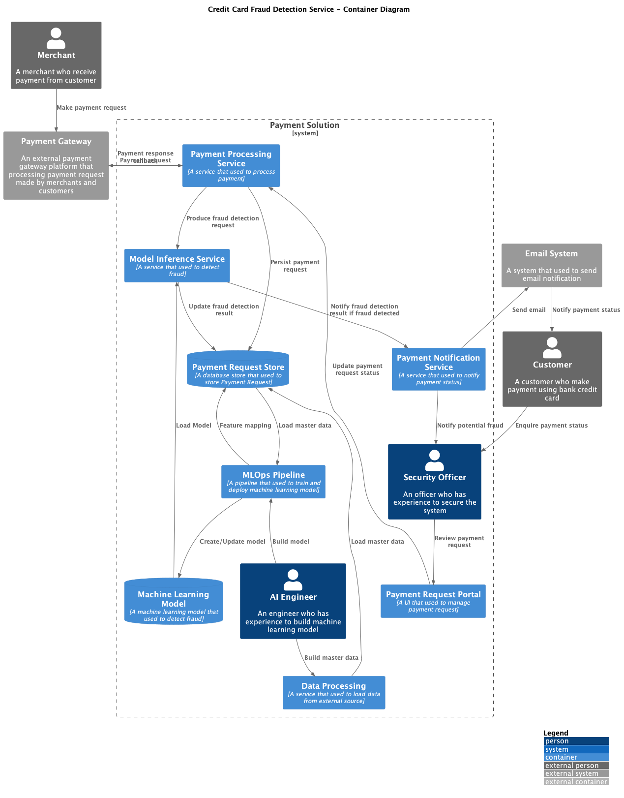
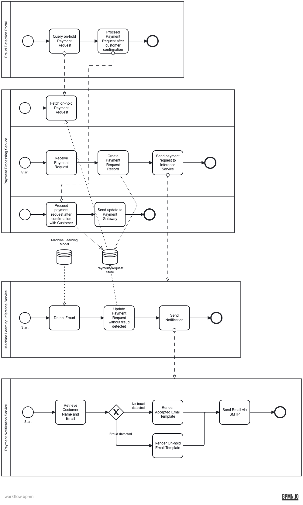
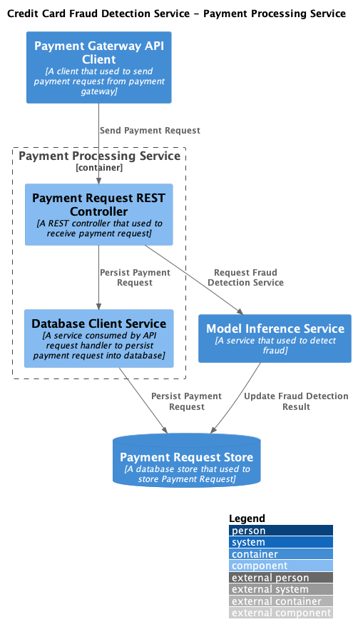

# PROJECT Report

Author: Wai Kei LAI

Date: 2024-10-10 

Check [readme.txt](readme.txt) for course work statement and self-evaluation. 
  

## R1 Requirements (project)

### R1 Write a project proposal (2-3 pages).

Complete? (Yes/No) Yes

If Yes, briefly describe: 

1. what you have done, 
2. what are the new features. 
3. Take some screen to demonstrate the features if applicable. 

#### Introduction

In the period of advancement of technology and financial development, there has been a drastic increase in such activities as credit card payments, banking, online fund transactions and others as a result of the expansion of information technology. While this increase in financial activities has made capital and resource deployment to be more effective, it has also exactly led to the increase of fraudulent activities. Because of the arising complexity of the fraudulent transaction, its defenders fall behind the old solutions and seek for advanced means for counterfeiting and fraud deterrence.

Option Consommateurs (2024) published a report which showed that around 30% of the Canadians remember themselves being a victim of the bank fraud. In fact, among those who felt the effects of bank fraud, almost 25% have taken some measure to defend themselves after the incident. This indicates that the aftermath of such kinds of fraud is not only loss of money but also loss of peace of mind, and victims become more vigilant on the security of their assets.

Fraud is a common phenomenon in the financial arena. Credit card fraud, banker cheque fraud, and EFT fraud and all of them pose great risk to the financial institution and its clients. This misuse of information or financial assets is caused by scam or dishonest persons with serious consequences to economies and the security of consumers. As a result, the issue of fraud transactions which has become common in financial transactions needs to be cured fairly very quickly by all concerned parties in this case the financial institutions.

The classical approaches which have been adopted by many of the companies whereby the review of transactions are being done on manual basis and most times more rules limits systems, is becoming more obsolete not because such systems are not in existence but because the fraud depots have become more advanced in their tactics. The procedures are very time consuming and require a lot of manpower and barely keeps pace with the development of the changes of the type of fraud. Therefore, new technologies for detection and measures to prevent fraud are needed which will be able to provide performance and flexibility in the timely and seamless detection of unauthorized activities.

#### Problem Solving and Algorithms

Over the past few years, ‘machine learning’ techniques have developed as one of the recent technologies for solving problems related to fraud detection in financial transactions. Before applying any model, it is understood that using machine learning requires a large volume of data which comprises past activities connected with fraud and instigates models to recognize them efficiently. Such models can also be designed using historical data on transactions and will keep getting better as additional data will continue becoming available.

In response to this pressing issue, various machine learning techniques have been proposed for fraud detection. One such technique involves the use of LightGBM for Credit Card Fraud Detection (Huang, 2020). This innovative approach to fraud detection could potentially be applied to our project, offering a promising solution to this pervasive problem with supporting  research by Du et al. (2023).

The primary objective of this project lies in identifying the suitable Proof of Concept within the appropriate context and testing the model based approach in the financial market using machine learning methods. The solution will include the use of the Kaggle Dataset ealtman2019/credit-card-transactions as it is based on the publication of Altman, E (2019). A number of elements may be identified as being part of this issue and the answer.

1. **Dataset Acquisition**: For the purpose of obtaining the dataset from Kaggle It is necessary to design a web UI as the AI Engineers will find it more convenient to fetch the required dataset from the UI I built. 
2. **Data Review and Mapping**: Up to this point, the dataset is in the AI Engineer’s hands, so the schema of the dataset will be examined by the AI Engineer. An editor will be developed in order to ease this occasion. Such tool will also allow artificial intelligence engineers’ simple data mapping on different dataset file format that are part of the dataset. They can also find pertinent attributes in the data and map them to their functions as well. Eventually, such mapping will support data understanding and also form part of the data to be fed into the ML operations of AI. This self-contained, visual tool will improve the process of reviewing data and also ensure that the AI model uses the important components.
3. **MLOps Pipeline**: To begin the MLOps pipeline using the MLOps platform a Rest API will be developed. At the earlier API calls MLOps data pipeline Rest endpoint of different platform will be invoked and this MLOps pipeline will cover those of data preparation engineering features and phases of AI model training as well as testing.
4. **AI Model Development**: The final step is the implementation of the MLOps pipeline that will incorporate the deployment of the ONNX model derived from the well trained AI model developed at the final stages of the training and testing processes.
5. **Transaction Validation**: To trigger the validation step, a Payment Order User Interface is being developed which will integrate with Payment Processing backend service. This particular service will leverage another machine learning inference background service which loads the AI model for fraud detection. If a transaction is suspected to be fraudulent then the transaction will be put on pending and a risk manager will be notified in order to investigate the transaction further.
6. **Notification of Customer**: Also if the transaction is recognized as a potentially fraudulent one, the customer will be sent an email about the potential fraud and further security check process.

##### Conceptual Design

###### Context Diagram

This project is going to use C4 model developed by Brown (2023) to break down the whole idea and visualize overall conceptual design.

<figure>
    
    <figcaption>Figure 1 - C4 Context Diagram</figcaption>
</figure>

Figure 1 illustrates the interactions between customer and the Payment Solution with Fraud Detection using AI. This setup not only facilitates efficient fraud detection automation but also supports to customer about their credit card payment. The platform's capabilities allow for better resource management, enabling financial institution to optimize internal resource efficiency and improve overall customer satisfaction from security perspective.

###### Container Diagram

<figure>
    
    <figcaption>Figure 2 - C4 Container Diagram</figcaption>
</figure>

In Figure 2, the system is subdivided into several vital containers as follows:

1. **Data Processing**: AI Engineer needs to prepare datasets for ML model training and testing and extracted data will be upload to database serving payment request feature mapping when receiving fraud detection request service.
2. **Payment Request Store**:  This relational database store gets to store payment requests and payment request status.
3. **MLOps Pipeline**: This is a very important container whereby information mapping from dataset to database table, data clean-up, feature engineering, model training and testing take place.
4. **Machine Learning Model**: This is LightGBM model mentioned by Huang (2020).
5. **Payment Processing Service**: This is public facing service that expose to payment gateway and response for the processing of payments from merchants who made the Payment request.
6. **Message Bus**: This message queue service facilitates to trigger fraud detection asynchronously as back office operation without impact against API throughput.
7. **Machine Learning Inference Service**: This services mainly serve all fraud detection request against incoming payment request. It will get and use machine learning model to identify any possible frauds.
8. **Payment Notification Service**: This service sends email alerts to customers if the transaction is successful or on hold if potential fraud detected.  If potential fraud is detected, security office will also be notified.
9. **Payment Request Portal:** This UI targets to serve security office to manage payment request, especially those with fraud detected by Machine Learning Inference Service.

###### Business Events and Workflow

<figure>
    
    <figcaption>Figure 3 - BPMN Model</figcaption>
</figure>

In this session, BPMN (n.d.) is used to illustrate how alll business process orchestrates together to deliver fraud detection solution. BPMN standardizes the way in which the business processes are represented in a diagrammatic way, thereby making the description of the workflow system less cumbersome. It allows the readers to depict accurately the position of tasks, deadlines, events, decision points, and the interactions among people and parts of the system. This means that it can improve partnership and coordination among business analysts, developers as well as system end users.

<table>
  <tr>
    <th>BPMN Lane</th>
    <th>Business Event</th>
    <th>Description</th>
  </tr>
  <tr>
    <td>Fraud Detection Portal</td>
    <td>Customer callback to query about on-hold transaction</td>
    <td>Security Officer will use this UI to query on-hold transaction and change the status from “on-hold” to “proceed” after review.</td>
  </tr>
  <tr>
    <td>Payment Processing Service</td>
    <td>Make payment request</td>
    <td>Payment processing is initiated by external payment gateway when merchant submit payment request to financial insituition.</td>
  </tr>
  <tr>
    <td>Machine Learning Inference Service</td>
    <td>Request fraud detection service</td>
    <td>The Payment Processing Service uses the Model Inference Service to identify the chances of Fraud in the Payment Request using a ML Model deployed by the system.</td>
  </tr>
  <tr>
    <td>Payment Notification Service</td>
    <td>Update payment transaction status</td>
    <td>When receiving notification request from Payment Processing Service, this service will retrieve customer name and email address, render the final email using email template, and send to SMTP server using SMTP Relay Service.</td>
  </tr>
  <caption style="caption-side:bottom">Table 1 - Business Process Lanes</caption>
</table>

<h7>Payment Processing Service</h7>

<figure>
  
  <figurecaption>Figure 4 - Payment Processing Service Component Diagram</figurecaption>
</figure>

As it can be seen in Figure 4, the Payment Processing Service, as part of the transversal functions within the Credit Card Fraud Detection Solution, allows receiving payment requests while avoiding the risks . Figure 4 shows how it contains several components that ensure that payments are made seamlessly.

Payment Gateway sends Payment Request and a REST Controller initiates a service that is the first in the payment request chain. This controller’s responsibility is to implement the workflow which consists of initiating the fraudulent detection of the payment and payment data management. In order to check if there is possible fraudulent abuse, the Payment Request Controller sends the request, which contains data, to the Model Inference service. Data comes back to this service which in turn has some actionable data which the controller considers some its relevant data and asleep out. When all operations have been performed to check the fraudulent abuse then Model Inference Service makes any necessary modification updates for the fraud detection.

The Payment Request REST Controller certainly does an extra job, it validates that there exists a payment request concerning the payment which is somewhere in the system. It connects with the database client and ensures that the request on payment is recorded in the Payment Request Store, which is a live payment application service. This ensures therefore that all the information regarding the payment is captured and can be retrieved for use or for record purposes.

Once generally evaluated and the payment request status is updated, it is efficiently transmitted the statsus back to external payment gateway. This client calls the payment gateway callback interface.

<h7>Machine Learning Inference Service</h7>

<figure>
  
  <figurecaption>Figure 4 - Model Inference Service Component Diagram</figurecaption>
</figure>

The Model Inference Service is an important part of the Credit Card Fraud Detection Service and is aimed at preventing fraud attempts in a payment order. It serves as the link between the Payment Processing Service and the fraud detection machine learning model. This service makes sure that every payment order has passed through the fraud assessment, and the outcome has been returned to the concerned stakeholders.

The service initiates its workflow through the Service Request Handler, which deals with incoming requests from the Payment Processing Service. In case a service request is raised for the purpose of fraud detection, the Service Request Handler takes the charge and sends the request to the Model Inference Engine. The Model Inference Engine is the single engine of the service, which runs the machine learning model using payment data as the input. It engages in a working relationship with the Machine Learning Model that has been uploaded with algorithms and the relevant data to display trends of suspiciousness in the payment requests.

When the fraud detection i.e. review procedure ends, it generates a result indicating whether there exists a chance of the current transaction being fraudulent rather than normal. This result is then routed back to the Payment Processing Service in order to bring level of fraud detection of the corresponding payment request to the appropriate level. Furthermore, the request handler also performs the function of informing interested parties in the state of the payment through the payment notification service in order to ensure that the result of the fraud detection process is indeed notified.

<h7>Payment Notification Backend Service</h7>

<figure>
  
  <figurecaption>Figure 4 - Payment Notification Service Compoent Diagram</figurecaption>
</figure>

The Payment Notification Service acts as a communicating channel for reliable and secure intercourse of information between the system, and the customers. The main objective of this service is to provide information to clients about incoming payment requests especially those assessed to be suspicious.

This service in its implementation is quite professional and is designed to be secure against tampering. The request handler only considers the customer ID as the needed parameter. After that the handler fetches the customer’s name and email address which does not compromise personal information and minimizes data breaches.

In addition the service uses the official company email or its variations that were previously constructed for all the purposes of correspondence. Such an approach guarantees orthodoxy and uniformity of the messages as well as the self-defense of the corporation from delictous phrases. Thus, the Payment Notification Service assists to secure the system and at the same time enables great communication with the clients.

If customers concern their on-hold payment if potential fraud detected, they need to approach security officer for further verificaition and special handling.

##### Proposed Technical Stack

The given technical stack utilizes commonly used or well known technologies and frameworks thus making it secure and easily adaptable to changes. The payment solution with fraud detection based on machine learning relies on the combination of Spring Boot as backend, Svelte as frontend, Mage.AI for MLOps, PostgreSQL for data storage, Minio for object storage, Docker for virtual technology and LightGBM as algorithm for dynamic fraud detection in payments.

Due to limited project timeline and PoC purpose, the following technical components ddi not include in this phase:

 - API Gateway (proposed: Kong API Gateway or Hashicorp Consul Connect)
 - Authentication and Authorization (proposed: Casdoor and Casbin)
 - HTTP Proxy (proposed: Caddy reverse proxy with Casdoor and Casbin integration)

### R2 Design data format, collect data, create dataset for the application.

 

Complete? (Yes/No) 

If Yes, briefly describe: 

1. what you have done, 
2. what are the new features. 
3. Take some screen to demonstrate the features if applicable. 

### R3 Develop and implement data application algorithms for the proposed application problem.

 

Complete? (Yes/No) 

If Yes, briefly describe: 

1. what you have done, 
2. what are the new features. 
3. Take some screen to demonstrate the features if applicable. 

### R4 Do data computing to generate models, representing models in portable format and stored in file or database. More credit is given if distributed approach is used data mining of big dataset.

 

Complete? (Yes/No) 

If Yes, briefly describe: 

1. what you have done, 
2. what are the new features. 
3. Take some screen to demonstrate the features if applicable. 

### R5 Create deployable service components using application models using Java based enterprise computing technologies, to create client program to do remote call of the data mining services.

 

Complete? (Yes/No) 

If Yes, briefly describe: 

1. what you have done, 
2. what are the new features. 
3. Take some screen to demonstrate the features if applicable. 

### R6 Deploy service components onto enterprise application servers.

 

Complete? (Yes/No) 

If Yes, briefly describe: 

1. what you have done, 
2. what are the new features. 
3. Take some screen to demonstrate the features if applicable. 

### R7 Create web services (SOAP, RESTful) to use the data service components.

 

Complete? (Yes/No) 

If Yes, briefly describe: 

1. what you have done, 
2. what are the new features. 
3. Take some screen to demonstrate the features if applicable. 

### R8 Create web user interface/mobile applications to use the application/web services.

 

Complete? (Yes/No) 

If Yes, briefly describe: 

1. what you have done, 
2. what are the new features. 
3. Take some screen to demonstrate the features if applicable. 

### R9 Test your services, log your services, and document your term project.

 

Complete? (Yes/No) 

If Yes, briefly describe: 

1. what you have done, 
2. what are the new features. 
3. Take some screen to demonstrate the features if applicable. 

### R10 Demonstrate your term project in final project presentation, slides, short video.

 

Complete? (Yes/No) 

If Yes, briefly describe: 

1. what you have done, 
2. what are the new features. 
3. Take some screen to demonstrate the features if applicable. 

**References**

1. CP630OC project
2. Agarwal, A., & Gupta, N. (2021, Jun 16). Comparison of Outlier Detection Techniques for Structured Data. doi:2106. ?
3. Altman, E. (2019). Synthesizing Credit Card Transactions. PsyArXiv. https://arxiv.org/pdf/1910.03033
4. Altman, E. (2019). Credit Card Transactions [Data set]. Kaggle. https://www.kaggle.com/datasets/ealtman2019/credit-card-transactions/data
5. BPMN. (n.d.). Object Management Group Inc. Accessed October 14, 2024. https://www.bpmn.org/
6. Brown, S. (2023). The C4 Model For Visualising Software Architecture. *Leanpub*. https://leanpub.com/visualising-software-architecture
7. Du, H. et al. (2023). AutoEncoder and LightGBM for Credit Card Fraud
Detection Problems. *Symmetry* 2023, 15, 870. https://doi.org/10.3390/sym15040870
8. Huang, K. (2020). An Optimized LightGBM Model for Fraud Detection. Journal of Physics: Conference Series, 1651, 012111, IOP Publishing. https://doi.org/10.1088/1742-6596/1651/1/012111
9. Option Consommateurs. (April 17, 2024). 30% of Canadians victims of bank fraud. Accessed October 14, 2024. https://option-consommateurs.org/en/communique-barometre-2024/
10. Speiser, J. L. (2021). A random forest method with feature selection for developing medical prediction models with clustered and longitudinal data. Journal of Biomedical Informatics, 117. doi:10.1016/j.jbi.2021.103763
11. Turkey, J. (1997). Exploratory Data Analysis. Addison-Wesley. ISBN 978-0-201-07616-5. 
